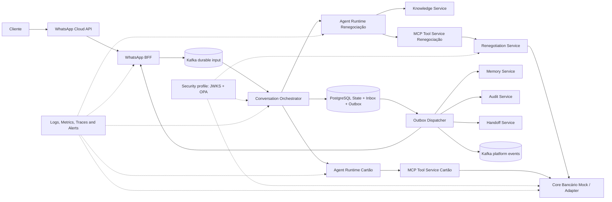
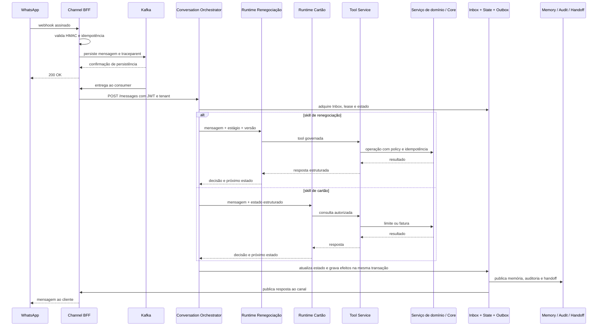

# Case aplicado — Plataforma conversacional bancária multi-skill

[📘 Abrir documentação publicada da Conversational AI Platform Architecture](https://leandrosflora.github.io/conversational-ai-platform-architecture/index.html){ .md-button .md-button--primary target="_blank" }

Este case demonstra como as capacidades da Enterprise AI Platform Reference Architecture podem ser materializadas em uma plataforma conversacional bancária com múltiplas skills, jornadas governadas, integração por ferramentas MCP, RAG, memória, auditoria, observabilidade e evidências executáveis.

A implementação atual cobre duas jornadas via WhatsApp:

- renegociação de dívidas, incluindo consultas, simulação e confirmação governada;
- consulta de limite e fatura de cartão, com fluxo somente leitura.

!!! info "Estado atual"
    A solução é uma **referência executável e uma POC endurecida**. Ela comprova arquitetura, contratos, controles e jornadas com um Core bancário mock, mas não representa certificação para produção bancária.

## Contexto

A plataforma recebe webhooks assinados do WhatsApp, persiste a entrada em Kafka antes do aceite, mantém estado transacional da conversa, seleciona a skill adequada, consulta conhecimento, executa ferramentas autorizadas e registra efeitos por meio de Inbox e Outbox.

Os serviços compartilhados fornecem memória, auditoria, handoff, observabilidade, evals e governança de release. Os serviços especializados isolam regras de renegociação e cartão, evitando que o agente acesse diretamente o Core bancário.

## Jornadas implementadas

| Jornada | Agent Runtime | Tool Service | Integração de domínio | Natureza |
|---|---|---|---|---|
| Renegociação | `agent-runtime-renegotiation` | `tool-service-renegotiation` | `renegotiation-service` → Core bancário mock | consultas e operações mutáveis governadas |
| Limite e fatura de cartão | `agent-runtime-fatura-cartao` | `tool-service-cartao-credito` | acesso à Card API do Core bancário mock | somente leitura |

O Conversation Orchestrator mantém o estado da jornada e roteia a conversa para o runtime especializado. A inclusão de uma segunda skill demonstra que a arquitetura não está limitada a um único agente ou produto bancário.

## Mapeamento para a arquitetura de referência

| Capacidade de referência | Implementação no case | Estado atual |
|---|---|---|
| Channel / Agent Gateway | WhatsApp BFF, Kafka de entrada e Conversation Orchestrator | Baseline implementada; responsabilidades de gateway permanecem distribuídas |
| Agent Runtime | runtimes especializados para renegociação e cartão | Implementado |
| MCP Tool Service | Tool Services de renegociação e cartão | Implementado |
| Workflow / Journey State | máquina de estados, lease, versionamento, Inbox e Outbox no Orchestrator | Implementado |
| Knowledge Service | OpenSearch com busca vetorial e PDFs por tenant | Implementado; conector corporativo e ACL por documento ainda pendentes |
| Memory Service | Redis para sessão e MongoDB para histórico | Implementado |
| Policy Enforcement | regras determinísticas nos Tool Services e serviço de domínio; profile executável com OPA | Baseline implementada; integração corporativa ainda pendente |
| Workload Identity | JWT HS256 por par no profile padrão; profile de migração RS256, OIDC e JWKS | Parcial; identidade nativa, mTLS e KMS permanecem pendentes |
| Audit | PostgreSQL com deduplicação por tenant e chave de idempotência | Implementado |
| Event Backbone | Kafka para entrada durável, retry, DLQ e eventos de plataforma | Implementado parcialmente; nem toda integração é orientada a eventos |
| Human Handoff | Conversation Handoff Service | Implementado como solicitação persistida; transferência bidirecional para plataforma humana ainda pendente |
| Observabilidade | Jaeger, Loki, Grafana Alloy, Prometheus, Grafana e Alertmanager | Baseline executável implementada; cobertura de métricas e receivers reais ainda evolutivos |
| Evaluation Service | evals offline e online versionados para as duas skills | Baseline executável implementada; avaliação contínua em produção ainda pendente |
| Release Governance | manifesto, lock com SHAs exatos, contratos executáveis e E2E multi-repositório | Baseline implementada; gate obrigatório e promoção por imagens atestadas ainda pendentes |
| Banking Core Integration | portas funcionais, modelos canônicos, adapters e profiles por ambiente | Readiness implementada com mock; contrato produtivo, certificação e reconciliação pendentes |
| Model Gateway | modelo configurado diretamente em cada runtime | Evolução recomendada |
| AI Catalog / Control Plane | documentação, contratos e configuração por repositório | Evolução recomendada |
| FinOps | custo e tokens previstos nos evals futuros, sem serviço centralizado | Evolução recomendada |

## Arquitetura implementada



O diagrama representa o estado implementado e os profiles executáveis. A arquitetura-alvo pode introduzir componentes centrais adicionais, como Agent Gateway, Model Gateway, catálogo de IA e FinOps.

## Fluxo simplificado



## Garantias demonstradas

| Aspecto | Garantia implementada |
|---|---|
| Entrada WhatsApp | ACK somente após persistência no Kafka |
| Autenticidade do canal | validação HMAC do webhook |
| Inbox | processamento idempotente por mensagem |
| Estado da jornada | lease, versão otimista e tratamento de mensagem atrasada |
| Side effects | Outbox at-least-once com deduplicação |
| Ordenação | efeitos de uma versão anterior bloqueiam a liberação da próxima |
| Tenant | tenant no header e em claim assinada |
| Tools | allowlist, estágio, versão e policy validados antes da execução |
| Operações mutáveis | `Idempotency-Key`, replay e conflito por payload divergente |
| Confirmação financeira | exige estágio e evidência ligada à mensagem atual |
| Memória | chaves segregadas por tenant e conversa |
| Audit e Handoff | deduplicação por tenant e chave de idempotência |
| Dados sensíveis | argumentos de tools e CPF não são publicados nos eventos de plataforma |
| RAG | índice e consulta segregados por tenant |

## Segurança e Policy Enforcement

O profile padrão da POC utiliza JWT HS256 com segredo independente por par de serviços. Esse baseline reduz o compartilhamento indiscriminado de credenciais, mas continua baseado em segredos simétricos.

Um profile de migração executável demonstra a evolução para:

- emissão RS256;
- descoberta OIDC e publicação JWKS;
- tokens curtos por workload e audience;
- allowlist entre emissor e destino;
- OPA como PDP centralizado;
- decisão fail-closed;
- evidência obrigatória para ações financeiras.

Esse profile valida contratos e estratégia de migração. Produção ainda exige identidade nativa de workload, KMS ou HSM, rotação, revogação, mTLS e integração com o IAM corporativo.

[Detalhes de Workload Identity e PDP](https://leandrosflora.github.io/conversational-ai-platform-architecture/security/workload-identity-pdp.html){ target="_blank" }

## Evals e evidências

A plataforma possui uma suite versionada de cenários para renegociação e cartão, cobrindo:

- saudação e identificação de intenção;
- consulta de dívida;
- simulação e jornada de renegociação;
- limite e fatura de cartão;
- handoff humano;
- mensagens fora de escopo;
- tentativa de ignorar regras.

Os evals podem ser executados em modo offline, sem infraestrutura, ou online contra os dois Agent Runtimes. Os relatórios registram aprovação, latência, handoff, violações de threshold e erros de expectativa.

A evolução necessária não é mais “criar evals”, mas ampliar a avaliação para modelos reais, groundedness, seleção de tools, custo, tokens, regressão por modelo e métricas online de produção.

[Detalhes dos evals](https://leandrosflora.github.io/conversational-ai-platform-architecture/testing/evals.html){ target="_blank" }

## Governança de release multi-repositório

A solução é composta pelo repositório de arquitetura e 12 repositórios de serviço. O manifesto de release resolve as referências de entrada para 13 SHAs exatos e produz um `release-lock.yaml` imutável.

A pipeline E2E multi-repositório pode:

1. resolver todos os repositórios para commits exatos;
2. executar builds e testes;
3. validar OpenAPI, AsyncAPI e policies;
4. subir o stack;
5. injetar um webhook assinado;
6. validar o Core autenticado;
7. executar evals online e carga;
8. publicar evidências vinculadas ao release lock.

A promoção produtiva ainda deve reutilizar imagens por digest, assinadas e atestadas, sem reconstrução entre ambientes.

[Detalhes de release e contratos executáveis](https://leandrosflora.github.io/conversational-ai-platform-architecture/governance/release-contract-governance.html){ target="_blank" }

## Readiness para integração com Core bancário

O Core bancário mock não é tratado como equivalente a um sistema produtivo. A arquitetura utiliza serviços de domínio, portas funcionais canônicas e adapters selecionados por ambiente:

```text
Agent / Tool Service
        ↓
Serviço de domínio
        ↓
Porta funcional canônica
        ↓
Adapter por ambiente
        ↓
Mock | Sandbox | API bancária real
```

As portas cobrem identificação do cliente, carteira de dívidas, elegibilidade, simulação, formalização e atendimento de cartão.

A solução comprova integração técnica E2E com mock, controle de jornada e baseline de segurança entre workloads. Ela não comprova regras financeiras reais, contrato produtivo, reconciliação ou certificação do produto.

Uma release produtiva deve ser bloqueada quando utiliza provider mock, dados sintéticos, operação mutável sem idempotência persistente ou formalização sem reconciliação.

[Detalhes de Banking Core Integration Readiness](https://leandrosflora.github.io/conversational-ai-platform-architecture/integration/banking-core-readiness.html){ target="_blank" }

## Observabilidade e operação

O ambiente local provisiona Jaeger, Loki, Grafana Alloy, Prometheus, Grafana e Alertmanager. Há regras versionadas para infraestrutura, DLQ, falhas de processamento, Outbox, autenticação e negações de policy.

SLOs iniciais foram definidos para recepção de webhook, processamento do Orchestrator, publicação da Outbox, tools governadas, RAG e infraestrutura observável.

A baseline não substitui operação corporativa. Permanecem necessários receivers reais, ownership, escalonamento, plantão, cobertura completa de métricas de aplicação e error budgets aprovados.

[Detalhes de SLOs e alertas](https://leandrosflora.github.io/conversational-ai-platform-architecture/operations/slo-alerting.html){ target="_blank" }

## Lacunas prioritárias

1. consolidar Agent Gateway e políticas transversais de canal;
2. introduzir Model Gateway com routing, fallback, quotas e medição de custos;
3. centralizar AI Catalog, configuração e lifecycle dos agentes;
4. integrar identidade corporativa de workload, KMS, rotação e mTLS;
5. conectar APIs bancárias reais com certificação, reconciliação e idempotência persistente;
6. ampliar evals para modelos reais e monitoramento contínuo de produção;
7. ativar receivers, ownership e processo corporativo de incidentes;
8. implementar retenção, anonimização, exclusão e recuperação regional aprovadas;
9. promover imagens assinadas por digest com proveniência verificável;
10. centralizar FinOps por agente, skill, modelo, tenant e jornada.

## Resultado arquitetural

O case demonstra que a arquitetura de referência suporta uma plataforma conversacional multi-skill, com componentes compartilhados e agentes especializados por domínio.

A implementação comprova padrões de entrada durável, estado transacional, tool calling governado, RAG, memória, auditoria, handoff, evals, observabilidade, segurança evolutiva e governança de release.

Ela também deixa explícita a fronteira entre três estados:

- **implementado:** validado em código, contratos, Compose ou evidência E2E;
- **baseline executável:** controle demonstrado localmente, ainda dependente de integração corporativa;
- **produção:** exige APIs reais, identidade forte, operação, compliance, resiliência e promoção de artifacts aprovados.

Essa separação evita tratar uma POC tecnicamente avançada como uma plataforma bancária pronta para produção, sem reduzir o valor da arquitetura e das evidências já construídas.
