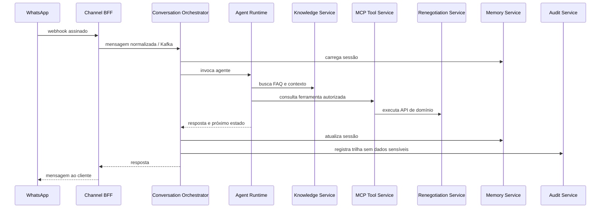

# Case aplicado — Plataforma conversacional para renegociação

**Repositório:** [conversational-ai-demo-arch](https://github.com/leandrosflora/conversational-ai-demo-arch)

Este case demonstra como capacidades da Enterprise AI Platform Reference Architecture podem ser materializadas em uma jornada conversacional de renegociação via WhatsApp.

## Contexto

A solução recebe mensagens do canal, mantém estado da conversa, recupera conhecimento, consulta elegibilidade e débitos, executa ferramentas governadas, registra auditoria e permite transferência para atendimento humano.

## Mapeamento para a arquitetura de referência

| Capacidade de referência | Implementação no case | Estado |
|---|---|---|
| Channel / Agent Gateway | WhatsApp BFF + Conversation Orchestrator | Parcial: responsabilidades distribuídas |
| Agent Runtime | `agent-runtime-renegotiation` | Implementado |
| MCP Tool Service | `tool-service-renegotiation` | Implementado |
| Knowledge Service | OpenSearch com busca vetorial por tenant | Implementado |
| Memory Service | Redis para sessão e MongoDB para histórico | Implementado |
| Audit | PostgreSQL com eventos da jornada | Implementado |
| Event Backbone | Kafka e inbox/outbox | Parcial: integração ainda majoritariamente HTTP |
| Human Handoff | Conversation Handoff Service | Implementado |
| Observabilidade | Jaeger, Loki, Prometheus e Grafana | Fundação implementada; instrumentação ainda evolutiva |
| Evaluation Service | validações E2E documentadas | Parcial; falta serviço contínuo de avaliação |
| Model Gateway | acesso ao modelo no runtime | Evolução recomendada |
| AI Catalog / Control Plane | documentação e configuração por repositório | Evolução recomendada |
| FinOps | não centralizado | Evolução recomendada |

## Fluxo simplificado

## Decisões demonstradas

- MCP como camada de tool calling governado;
- memória separada por temporalidade;
- Kafka como entrada durável e inbox/outbox para confiabilidade;
- JWT interno com isolamento por tenant;
- retrieval vetorial com índice por tenant;
- correlação de logs e traces entre serviços;
- handoff explícito para atendimento humano.

## Lacunas úteis como roadmap

1. consolidar Agent Gateway e políticas transversais;
2. introduzir Model Gateway com routing, fallback e custos;
3. automatizar avaliações de qualidade, segurança e regressão;
4. produzir eventos padronizados de uso e custo;
5. completar OpenTelemetry nos serviços de aplicação;
6. amadurecer gestão de segredos, rotação e criptografia em repouso.

## Resultado arquitetural

O case valida que a arquitetura é decomponível e executável, sem afirmar que toda organização precise da mesma quantidade de serviços. Em ambientes menores, componentes podem ser agrupados; em escala corporativa, os limites permitem ownership, segurança e evolução independentes.