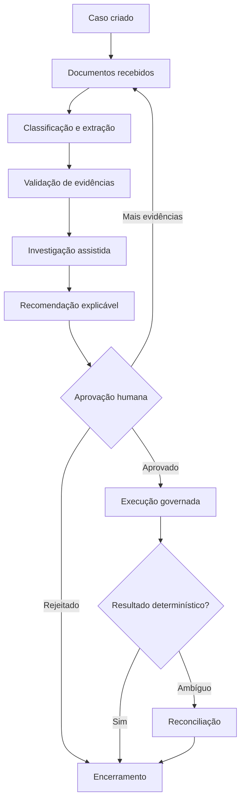
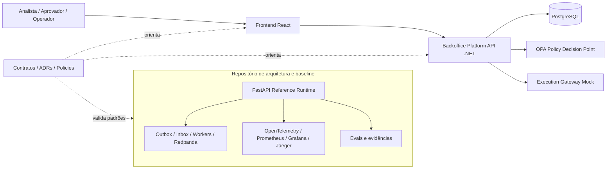
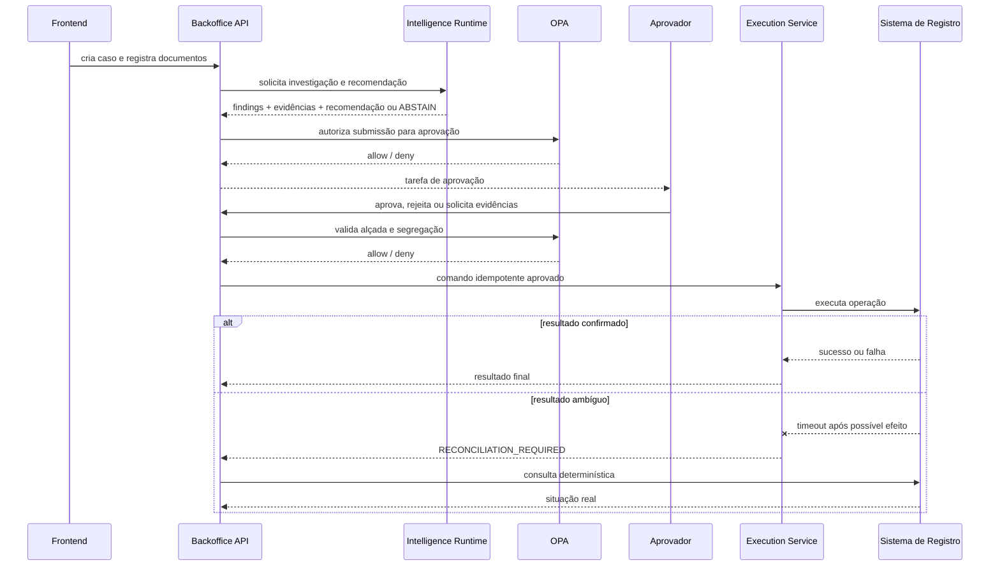

# Applied case  Intelligent Backoffice for banking disputes

[ Open published documentation from the Intelligent Backoffice](https://leandrosflora.github.io/intelligent-backoffice-platform-architecture/){ .md-button .md-button--primary target="_blank" }

[Architecture on GitHub] https://github.com/leandrosflora/intelligent-backoffice-platform-architecture
[Backend .NET] https://github.com/leandrosflora/backoffice-platform-api
[Frontend React] https://github.com/leandrosflora/intelligent-backoffice-frontend

This case demonstrates how the capabilities of Enterprise AI Platform Reference Architecture can be applied to a regulated, documentary and long-term back office process.

The selected time frame is a **banking questionnaire**, involving documents, research, recommendation, bid approval, governed execution, ambiguous outcome treatment and audit.

The Commission shall adopt implementing acts in accordance with the opinion of the European Parliament and of the Council.
    The architecture, contracts and controls have an executable baseline with synthetic data. The .NET backend and the React frontend have begun to materialize the product in separate repositories.`NOT_PRODUCTION_READY`.

## Business problems

Dispute resolution processes typically go through different areas, documents and systems. Part of the analysis remains manual, hand-offs are difficult to track, and an incorrect decision can generate financial, regulatory and reputational impact.

The main problems dealt with in the case are:

- time to gather and validate evidence;
- rework caused by incomplete documents;
- research spread across different systems;
- inconsistent or unexplainable decisions;
- difficulty in applying elevation and function segregation;
- the risk of duplicate execution;
- the absence of explicit treatment for ambiguous financial results;
- fragmented evidence between logs, banks and manual processes.

## Outcome esperado

The platform organises the challenge as a governed and measurable journey:

| Outcome | Indicador sugerido |
|---|---|
| Reducing cycle time | time between the creation and closure of the case |
| Reduzir retrabalho documental | Percentage of cases with supplementary requests |
| Improving consistency | divergence between recommendation, approval and applicable rule |
| Aumentar rastreabilidade | Percentage of decisions with evidence, versions and registered actor |
| Evitar efeito duplicado | Conflicts and replays blocked by impotence |
| Tratar incerteza operacional | Time to reconcile ambiguous executions |
| Control the autonomy of AI | percentage of abstention, human review and policy denials |

## Jornada aplicada

The authority over the process remains in the workflow. AI acts in analysis and recommendation, but does not control the lifecycle, does not approve or execute financial effects.

## Where the AI comes in

AI is positioned in three main capacities.

### 1. Document Intelligence

It receives documents as unreliable content and can execute:

- OCR;
- documentary classification;
- the extraction of fields;
- identification of inconsistencies;
- a trust assessment;
- the conversion of extracts into versioned evidence.

The expected output is not a decision but a structured set of evidence, with origin, location, trust, model version and pipeline version.

### 2. Investigation Agent

Gather evidence and consult governed tools, for example:

- the contested transaction;
- the history of the customer;
- Authentications and devices;
- sinais antifraude;
- disputas anteriores;
- establishment data;
- rules and knowledge approved.

The tools shall be mediated by a Tool Gateway or equivalent layer, with allowlist, tenant, purpose, timeout, data minimization, policy and audit.

### 3. Decision Support Agent

It produces a structured recommendation containing:

- outcome sugerido;
- justificativa;
- confidence;
- evidence used;
- the rules considered;
- template and prompt;
- `ABSTAIN` when grounding is insufficient.

The recommendation follows policy enforcement and human approval. It does not directly alter the status of the case.

## What remains deterministic

| Responsabilidade | Why it shouldn't depend on generative AI |
|---|---|
| Case lifecycle | transitions and states need to be predictable and auditable |
| Competition and versioning | conflicts must be objectively detected |
| Impotence | Repetition of the same request cannot produce a new effect |
| Height and segregation | Authorisation is a formal rule. |
| Policy enforcement | Access decisions must be explicit and fail-closed |
| Final approval | Human responsibility for sensitive action |
| Financial execution | variable effect must use a governed domain service |
| Reconciliation | confirmation must come from objective evidence of the registration system |
| Outbox and Inbox | Delivery and deduplication are infrastructure mechanisms |

## Real situation of intelligence

The solution already has contracts, extension points and controls for AI, but the current implementation still uses deterministic mechanisms in parts of the journey.

| Capacity | Baseline to be executed | Product backend | The evolution of AI |
|---|---|---|---|
| Classification of documents | rules for metadata and file name | documentary recording and evidence | OCR and the actual documentary model |
| Research | evidence-based deterministic engine | `InvestigationEngine`deterministic | Agent with controlled tools |
| Recommendation | `APPROVE` ou `ABSTAIN`as a rule | `RecommendationEngine`deterministic | Decision Support Agent with grounding |
| Model Gateway | defined in the target architecture | not yet implemented | gateway provider-agnostic |
| Knowledge Service | responsabilidade arquitetural | not yet integrated into the product | Hybrid search and approved knowledge |
| Evals | Data set and thresholds in the baseline | Not yet connected to the .NET backend | offline and online evals by template and prompt |

"Real AI is still an evolution"
    The case should not be presented as a productive application of LLM. Today it mainly demonstrates the workflow, risk controls, separation of responsibilities and contracts needed to safely incorporate real models.

## Mapping for the Enterprise AI Platform

| Reference capacity | Materialisation in the case | Current status |
|---|---|---|
| Channel / Experience | React console to create and operate cases | `IMPLEMENTATION_STARTED` |
| Agent Gateway | input still concentrated in the API; dedicated gateway is evolution | `TARGET_DEFINED` |
| Agent Runtime | research and recommendation as deterministic modules | baseline `DEMONSTRATED_LOCAL`; produto `IMPLEMENTATION_STARTED` |
| Model Gateway | recommended interface for provider-agnostic access | `TARGET_DEFINED` |
| Knowledge Service | knowledge and rules as approved sources of research | `TARGET_DEFINED` |
| MCP / Tool Execution | governed tools for research consultations | `CONTRACT_DEFINED` |
| Workflow Orchestration | Persistent lifecycle, version, timers and transitions | `DEMONSTRATED_LOCAL` in the baseline |
| Policy Enforcement | External OPA, default deny, height, purpose and segregation | `DEMONSTRATED_LOCAL` in the baseline; initiated in the backend |
| Human Approval | approval, rejection and request for evidence | `DEMONSTRATED_LOCAL` |
| Governed Execution | Impotent mock execution and reconciliation | `DEMONSTRATED_LOCAL` |
| Event Backbone | Outbox, Inbox, workers, retry, DLQ and replay | `DEMONSTRATED_LOCAL` in the baseline |
| Evidence and Audit | timeline, versions, events and evidence references | `DEMONSTRATED_LOCAL` |
| Evaluation Service | Evaluations of classification, grounding and abstention | `DEMONSTRATED_LOCAL` in the baseline |
| Observability | metrics, traces, dashboards, and so on.SLOsand alerts | `DEMONSTRATED_LOCAL` in the baseline |
| Workload Identity | JWT Local and target EDDSA of IAM or SPIFFE | Baseline demonstrated; product still uses development headers |
| Supply Chain | SBOM and origin in the baseline | `DEMONSTRATED_LOCAL` |
| FinOps | the expected cost, tokens and budgets for Intelligence Runtime; | `TARGET_DEFINED` |
| AI Catalog / Control Plane | contracts, ADRs, policies and versioned statements | `CONTRACT_DEFINED` |

## Current ecosystem architecture

The FastAPI baseline is not the product backend. It functions as an executable specification to validate standards, contracts, and controls as the frontend and backend evolve into their own repositories.

## Repositories for implementation

| Repository | Responsabilidade | Classification |
|---|---|---|
| [intelligent-backoffice-platform-architecture](https://github.com/leandrosflora/intelligent-backoffice-platform-architecture) | architecture, C4, ADRs, contracts, policies, executable baseline, evals and readiness | `CONTRACT_DEFINED`and `DEMONSTRATED_LOCAL` |
| [backoffice-platform-api](https://github.com/leandrosflora/backoffice-platform-api) | It's the .NET 9 backend, the domain, the PostgreSQL,OPAand APIsof the journey | `IMPLEMENTATION_STARTED` |
| [intelligent-backoffice-frontend](https://github.com/leandrosflora/intelligent-backoffice-frontend) | React console, guided journey and consumption of APIs | `IMPLEMENTATION_STARTED` |

## Demonstrated controls

| Risco | Control applied |
|---|---|
| Unlawful self-determination | AI only investigates and recommends |
| self-approval | The authorising officer and the authorising officer shall be separate |
| out-of-court approval | OPA shall verify the authority of the authorising officer |
| Recommendation without grounding | compulsory evidence and option of `ABSTAIN` |
| duplicate implementation | `Idempotency-Key` and command hash |
| Retry blind after timeout | An ambiguous outcome requires reconciliation |
| acesso cross-tenant | tenant in identity, resource and persistence |
| PDP not available | policy enforcement fail-closed |
| event replay | Ident inbox and authorised replay |
| Loss of evidence | timeline and persistent references |
| prompt injection documental | Content treated as unreliable and separate from instructions |
| coupling to model supplier | Model Gateway provider-agnostic as evolution |

## Approval and enforcement flow

## Evidence available from the Commission

The architecture repository publishes evidence for:

- walkthrough end to end;
- lifecycle and versioning;
- positive and negative policies;
- the segregation of functions;
- ineffective execution;
- ambiguous outcome and reconciliation;
- the outbox, inbox, retry, DLQ and replay;
- deterministic evaluations;
- metrics, traces, dashboards and SLOs;
- identidade assinada local;
- synthetic capacity;
- backup and restore;
- SBOM and provenance.

[Execute the walkthrough of the challenge](https://leandrosflora.github.io/intelligent-backoffice-platform-architecture/tutorials/dispute-walkthrough/){ target="_blank" }

## State of implementation

| Gate | State of origin |
|---|---|
| Architecture, contracts and policies | `CONTRACT_DEFINED` |
| Baseline FastAPI | `DEMONSTRATED_LOCAL` |
| Backend .NET | `IMPLEMENTATION_STARTED` |
| Frontend React | `IMPLEMENTATION_STARTED` |
| Frontend + API + PostgreSQL + OPAin cross-sectional E2E | Pendente |
| Real model, RAG and corporate tools | Pendente |
| Integration with the real financial system | Pendente |
| Corporate identity and mTLS | Pendente |
| Operation with SLOs and on call | Pendente |
| Production readiness | `NOT_PRODUCTION_READY` |

## Future developments

### P8  Product integration

1. It consists of a built-in frontend, API, PostgreSQL and OPA;
2. E2E cross-section of the main journey;
3. automated compatibility between OpenAPI and implementation;
4. recovery of recommendations and approvals by API;
5. Signed backend identity and frontend login;
6. the product backend's observability and evidence.

### P9 — Intelligence Runtime

1. Provider-agnostic interfaces for AI;
2. Model Gateway;
3. Document Intelligence with OCR and real extraction;
4. Investigation Agent with controlled tools;
5. Decision Support Agent with grounding and `ABSTAIN`;
6. Knowledge Serviceand hybrid search;
7. persistence of prompt, template, fonts and tool calls;
8. evaluations of groundedness, hallucination, tool selection, safety, cost and latency;
9. the research and recommendation view on the frontend.

## Architectural lessons

1. **AI does not replace workflow.** Long processes, retries, timers and transitions need deterministic authority.
2. **Recommendation is not authorization.** An output from the model does not give rise or permission.
3. ** Execution needs to be isolated from AI.** Variable effects go through domain service, policy and idempotence.
4. **Operational uncertainty needs state of its own.** Timeout after possible effect is neither success nor failure safe.
5. **Evidence must arise with the decision.** Reconstructing evidence later is insufficient for audit.
6. **Architecture needs to declare what's still mock.** Deterministic code should not be confused with real AI.
7. **Baseline and product may evolve on separate tracks.** The baseline validates standards as product repositories progressively incorporate controls.

## References

- [Full documentation of the Intelligent Backoffice](https://leandrosflora.github.io/intelligent-backoffice-platform-architecture/)
- [Applied case of opposition](https://leandrosflora.github.io/intelligent-backoffice-platform-architecture/case-study/)
- [current status × target](https://leandrosflora.github.io/intelligent-backoffice-platform-architecture/architecture/implementation-status/)
- [Implementation repositories](https://leandrosflora.github.io/intelligent-backoffice-platform-architecture/implementation/product-repositories/)
- [ADRs of the case](https://leandrosflora.github.io/intelligent-backoffice-platform-architecture/decisions/)
- [Production readiness](https://leandrosflora.github.io/intelligent-backoffice-platform-architecture/governance/production-readiness/)
