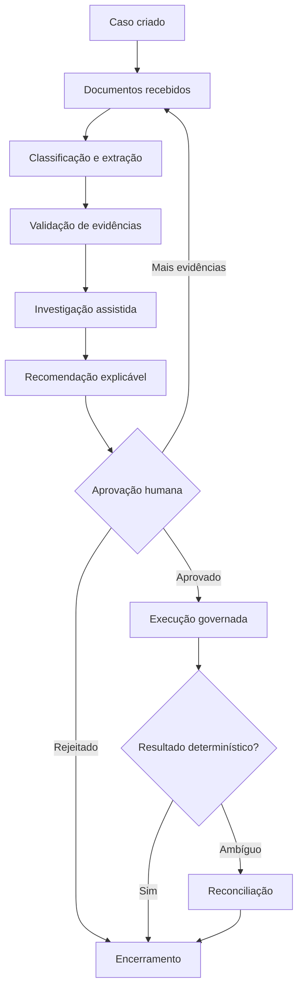
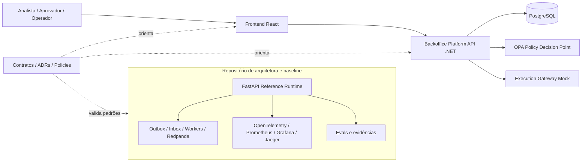
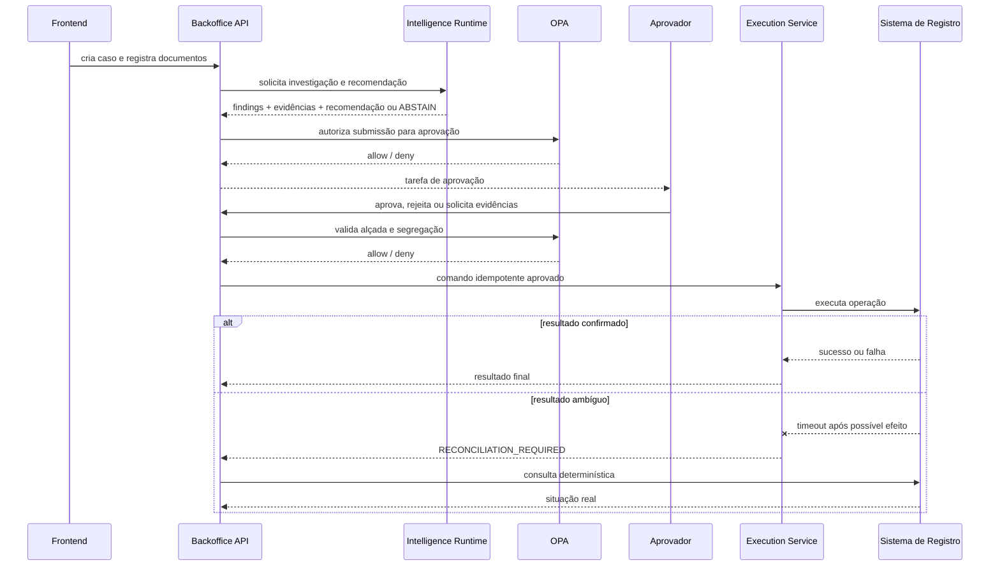

# Case applied — Intelligent Backoffice for bancarial contestation

[                                                                                                                                                                                               https://leandrosflora.github.io/intelligent-backoffice-platform-architecture/){ .md-button .md-button--primary target="_blank" }

[Arcash on GitHub](https://github.com/leandrosflora/intelligent-backoffice-platform-architecture).md-button target="_blank" 
[Backend.NET](https://github.com/leandrosflora/backoffice-platform-api).md-button target="_blank" 
[Frontend React](https://github.com/leandrosflora/intelligent-backoffice-frontend).md-button target="_blank" 

This case shows how the capabilities of the Enterprise AI Platform Reference Architecture can be applied to a regular, documentary and long-term backoffice process.

The chosen report is a **banking contest**, involved documents, research, recommendation, approval by stage, governance implementation, treatment of ambourbon and audit.

!!! info "Estado atual"
    The architecture, contracts and controls have an executable baseline with statistical data. Backend.NET and Frontend React have begun to materialise the product in separate databases. The joint integration is not yet classified as valid and the solution remains `NOT_PRODUCTION_READY`.

## Business problem

Processes of contest normally take different areas, documents and systems. Part of the analysis is manual, handoffs are difficult to draw and an incorrect decision can have financial, regulatory and reputation impact.

The main problems dealt with in the case are:

- high time to gather and validate evidence;
- reworked by incomplete documents;
- research distributed between different systems;
- inconsistent or slightly explicable decisions;
- difficulty of implementing a fixed and separate function;
- a double-executed risk;
- lack of explitive treatment for financial results;
- fragmented evidence between logs, banks and daily processes.

## Outcome esperado

The platform organizes the contest as a government and measurable newspaper:

| Outcome | Indicador sugerido |
|---|---|
| Reduce cycle time | time between the creation and the closure of the case |
| Reduzir retrabalho documental | percentage of cases with a request for a supplement |
| Improve consistency | divergence between recommendation, approval and applicable rule |
| Aumentar rastreabilidade | percentage of decisions with evidence, versions and recorded actors |
| Evitar efeito duplicado | conflict and replays blocked by idempotence |
| Tratar incerteza operacional | time to reconcile ambidiols |
| Control autonomial IA | percentage of abstention, human review and policy denial |

## Jornada aplicada

The authority on the process remains in the workflow. The AI takes an analysis and recommendation, but does not control the lifecycle, does not approve and does not execute financial effects.

## Where the IA enters

The AI is capable of three main capabilities.

### 1. Document Intelligence

You get documents as untrustworthy and you can execute:

- OCR;
- document classification;
- a slut of fields;
- identification of inconsistencies;
- confidence assessment;
- transformation of extraditions in versioned evidence.

The exit is not a decision, but a set of evidence, with origin, location, confidence, model version and pipeline version.

### 2. Investigation Agent

Evidence and consultation of the governed methods, for example:

- contested transaction;
- the history of the client;
- authenticated and device;
- sinais antifraude;
- disputas anteriores;
- established data;
- regras e conhecimento aprovados.

The tools shall be mediated by an equivalent Tool Gateway or a corresponding box, with allowlist, tenant, finality, timeout, data minimisation, policy and audit.

### 3. Decision Support Agent

It produces a structured recommendation containing:

- outcome sugerido;
- justificativa;
- trust;
- evidence used;
- regras consideradas;
- model and prompt version;
- `ABSTAIN` when grounding is insufficient.

The recommendation for enforcement and human adoption is followed, and it does not directly alter the status of the case.

## What remains determined

| Responsabilidade | Because it must not depend on the generic A |
|---|---|
| Case Lifecycle | transactions and procedures must be planned and audited |
| Competition and version | Conflicts must be detected in a purely objective manner |
| Idempotence | Replication of the same request cannot be a new effect |
| Alone and separation | Authorisation is a formal rule |
| Policy enforcement | Access decisions must be explended and closed |
| Final amplification | human responsibility for sensitive action |
| Financial investigation | amutable effect must be used in the government office |
| Reconciliation | confirmation must be based on objective evidence of the register system |
| Outbox e Inbox | delivery and decoding are infrastructure mechanisms |

## Real situation of intelligence

The solution already has contracts, extensions and controls for AI, but the current implementation still uses certain mechanisms in the newspaper.

| Capacidade | Executable Baseline | Backend of product | IA evolution |
|---|---|---|---|
| Documentary classification | rules for metadata and name of the file | documentary records and evidence | CR and real document model |
| Research | deterministic engine based on evidence | `InvestigationEngine` deterministic | agent with managed tools |
| Recommendation | `APPROVE` or `ABSTAIN` by rule | `RecommendationEngine` deterministic | Decision Support Agent with grounding |
| Model Gateway | defined in the acoustic arc | not yet implemented | gateway provider-agnostic |
| Knowledge Service | responsabilidade arquitetural | not yet integrated to the product | - a full-service and knowledge-adopted |
| Evals | dataset and thresholds at baseline | not yet connected to the.NET backend yet | offline and online by model and prompt |

!!! warning "It's still a change"
    The case should not be presented as a production application of LLM. Today it demonstrates the workflow, risk controls, the separation of responsibility and the contracts necessary to incorporate real models with security.

## Map for Enterprise AI Platform

| Reference capacity | Materialisation in the case | Estado atual |
|---|---|---|
| Channel / Experience | console React to create and operate cases | `IMPLEMENTATION_STARTED` |
| Agent Gateway | inserted still concentrated in API; designated gateway is evolution | `TARGET_DEFINED` |
| Agent Runtime | research and recommendation as determined molecules | baseline `DEMONSTRATED_LOCAL`; produto `IMPLEMENTATION_STARTED` |
| Model Gateway | recommended interface for access to provider-agnostic | `TARGET_DEFINED` |
| Knowledge Service | knowledge and rules as sources approved for research | `TARGET_DEFINED` |
| MCP / Tool Execution | Tools for research consultations | `CONTRACT_DEFINED` |
| Workflow Orchestration | persistent lifecycle, version, timers and transitions | `DEMONSTRATED_LOCAL` at baseline |
| Policy Enforcement | External AP, default denied, imposed, proposito and separation | `DEMONSTRATED_LOCAL` at baseline; initiated in backend |
| Human Approval | approval, rejection and application of evidence | `DEMONSTRATED_LOCAL` |
| Governed Execution | mock idempotent execution and reconciliation | `DEMONSTRATED_LOCAL` |
| Event Backbone | Outbox, Inbox, workers, retry, DLQ e replay | `DEMONSTRATED_LOCAL` at baseline |
| Evidence and Audit | timeline, versions, events and evidence references | `DEMONSTRATED_LOCAL` |
| Evaluation Service | classification, grounding and abstention values | `DEMONSTRATED_LOCAL` at baseline |
| Observability | traces, dashboards, SLOs and alerts | `DEMONSTRATED_LOCAL` at baseline |
| Workload Identity | JWT EdDSA local and target of IAM or SPIFFE | baseline shown; product still uses development headers |
| Supply Chain | SMMO and provenance at baseline | `DEMONSTRATED_LOCAL` |
| FinOps | Cost, tokens and budgets for the Runtime Intelligence | `TARGET_DEFINED` |
| AI Catalog / Control Plane | contratos, ADRs, policies e estados versionados | `CONTRACT_DEFINED` |

## Current ecological asymmetry

The FastAPI baseline is not the product backend. It functions as executable specification to validate contracts, contracts and controls while frontend and backend evolve in own repository.

## Implementing recommendations

| Repositor | Responsabilidade | Classification |
|---|---|---|
| [intelligent-backoffice-platform-architecture](https://github.com/leandrosflora/intelligent-backoffice-platform-architecture) | acoustics, C4, ADRs, contracts, policies, execution baseline, values and readiness | `CONTRACT_DEFINED` e `DEMONSTRATED_LOCAL` |
| [backoffice-platform-api](https://github.com/leandrosflora/backoffice-platform-api) | backend.NET 9, domain, PostgreSQL, OPA and APIs of the newspaper | `IMPLEMENTATION_STARTED` |
| [intelligent-backoffice-frontend](https://github.com/leandrosflora/intelligent-backoffice-frontend) | console React, framed and used by APIs | `IMPLEMENTATION_STARTED` |

## Controls demonstrated

| Risco | Controle aplicado |
|---|---|
| unfounded autônomous decision | IA apenas investiga e recomenda |
| self-approval | recommendant and approver must be distinguished |
| approval out of reach | OPs check the approval authority |
| recommendation without grounding | obligations and options of `ABSTAIN` |
| double execution | `Idempotency-Key` and the command hash |
| retry chowder after timeout | Ambiguo result requires reconciliation |
| acesso cross-tenant | tenant in identity, resource and persistance |
| Undisponible PDP | policy enforcement fail-closed |
| replay of event | Inbox idempotente e replay autorizado |
| Evidence loss | timeline and persistent references |
| prompt injection documental | content treated as untrustworthy and separate from instructions |
| acquitting the model supplier | Model Gateway provider-agnostic as evolution |

## Appropriation flux and implementation

## Evidence available

The public archive of evidence for:

- walkthrough point to point;
- lifecycle e versionamento;
- policies positivas e negativas;
- separation of functions;
- idempotent execution;
- Ambiguous and reconciliation result;
- outbox, inbox, retry, DLQ e replay;
- deterministic values;
- methods, trace, dashboards and SLOs;
- identidade assinada local;
- a physical capacity;
- backup e restore;
- - syringe and provenance.

[Executing the contest entry walkthrough](https://leandrosflora.github.io/intelligent-backoffice-platform-architecture/tutorials/dispute-walkthrough/) target="_blank" 

## Implementation state

| Gate | Estado |
|---|---|
| Architecture, contracts and policies | `CONTRACT_DEFINED` |
| Baseline FastAPI | `DEMONSTRATED_LOCAL` |
| Backend .NET | `IMPLEMENTATION_STARTED` |
| Frontend React | `IMPLEMENTATION_STARTED` |
| Frontend + API + PostgreSQL + OPA in E2E cross-reference | Pendente |
| Real model, RAG and corporated tools | Pendente |
| Integration with real financial system | Pendente |
| Identidade corporativa e mTLS | Pendente |
| Operation with SLOs and on-call | Pendente |
| Production readiness | `NOT_PRODUCTION_READY` |

## Next developments

### P8 — Product integration

1. Integrated frontend, API, PostgreSQL and OPA;
2. E2E cross-reference of the main story;
3. a automated compatibility between OpenAPI and implementation;
4. re-approval of recommendations and approvals by API;
5. identity inserted in the backend and login on the frontend;
6. observation and evidence in the product backend.

### P9 — Intelligence Runtime

1. interfaces provider-agnostic for IA;
2. Model Gateway;
3. Intelligence Document with CR and real extradition;
4. Investigation Agent with managed tools;
5. Decision Support Agent with grounding and `ABSTAIN`;
6. Knowledge Service and obtain hybrid;
7. prompt persistance, model, source and tool calls;
8. a range of a range of a range of a range of a range of a range of a range of a range of a range of a range of a range of a range of a range of a range of a range of a range of a range of a range of a range of a range of a range of a range of a range of a range of a range of a range of a range of a range of securing, maintenance, cost and latability;
9. visualisation of research and recommendation on the frontend.

## Aquivalent licences

1. **IA does not replace workflow.** Long-term processes, review, timers and transitions require deterministic authority.
2. **Recommendation is not authorisation.** A exit from the model does not grant granted granted or permissible.
3. **Executive needs to be isolated from the A.** Mutual effects pass by field, policy and idempotence.
4. **Operative uncertainty needs state.** Timeout after possible effect is not successful or safe.
5. **Evidence must be taken together with the decision.** Reconstrued justified after it is inadequate for auditory.
6. **The architecture needs to say what is still mock.** The definitive code must not be confused with real AI.
7. **Baseline and product may evolve in separate columns.** The valid baseline applies as the product repository incorporates the controls gradually.

## References

- [Complete Edition of the Intelligent Backoffice](https://leandrosflora.github.io/intelligent-backoffice-platform-architecture/)
- (when applied for contestation)(https://leandrosflora.github.io/intelligent-backoffice-platform-architecture/case-study/)
- [Estado atual × alvo](https://leandrosflora.github.io/intelligent-backoffice-platform-architecture/architecture/implementation-status/)
- (implementing proposals)(https://leandrosflora.github.io/intelligent-backoffice-platform-architecture/implementation/product-repositories/)
- (ADRs of the case)(https://leandrosflora.github.io/intelligent-backoffice-platform-architecture/decisions/)
- [Production readiness](https://leandrosflora.github.io/intelligent-backoffice-platform-architecture/governance/production-readiness/)
