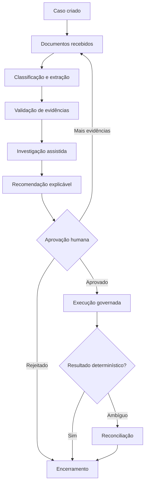
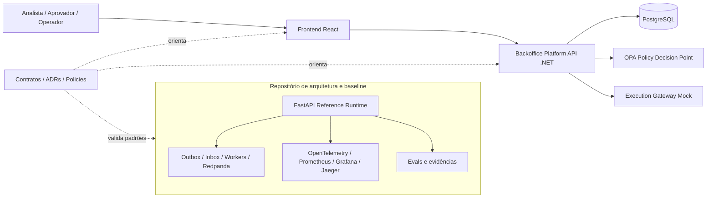
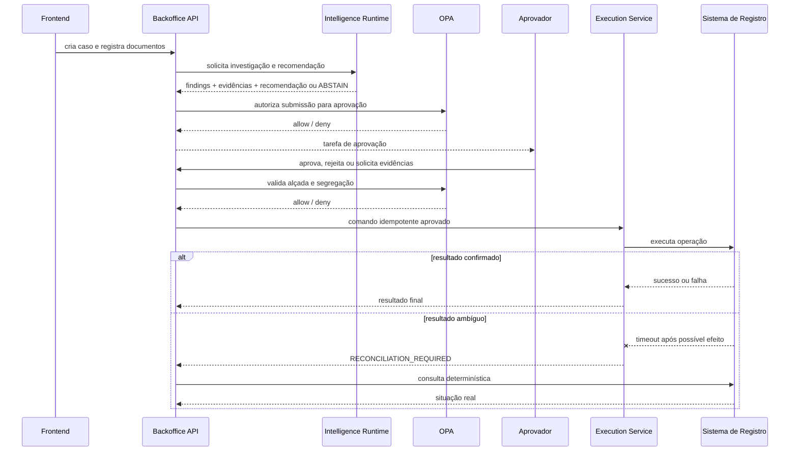

# Case applied — Intelligent Backoffice for bank contest

[ Opening published documentation of the Intelligent Backoffice](https://leandrosflora.github.io/intelligent-backoffice-platform-architecture/){ .md-button .md-button--primary target="_blank" }

[Architecture in GitHub](https://github.com/leandrosflora/intelligent-backoffice-platform-architecture){ .md-button target="_blank" }
[Backend .NET](https://github.com/leandrosflora/backoffice-platform-api){ .md-button target="_blank" }
[Frontend React](https://github.com/leandrosflora/intelligent-backoffice-frontend){ .md-button target="_blank" }

This case demonstrates how the capabilities of the Enterprise AI Platform Reference Architecture can be applied to a regulated, documentary and long-term backoffice process.

The chosen journey is a **bank contest**, involving documents, investigation, recommendation, approval by heading, governed execution, ambiguous outcome treatment and audit.

!!! info "State current"
    The architecture, contracts and controls have an executable baseline with synthetic data. The backend .NET and the frontend React have begun to materialize the product in separate repositories. The joint integration is not yet classified as validated and the solution remains `NOT_PRODUCTION_READY`.

## Business problem

Contest processes usually go through different areas, documents and systems.Part of the analysis remains manual, handoffs are difficult to track and an incorrect decision can generate financial, regulatory and reputational impact.

The main problems treated by the case are:

- high time to gather and validate evidence;
- retrabalho causado by documents incompletos;
- distributed research between different systems;
- inconsistent or inexplicable decisions;
- difficulty in applying handle and segregating functions;
- risk of duplication;
- lack of explicit treatment for ambiguous financial results;
- fragmented evidence between logs, banks and manual processes.

## Outcome esperado

The platform organises dispute as a governed and measurable journey:

| Outcome | indicator sugerido |
|---|---|
| Reduce cycle time | time between case creation and closure |
| reduce retrabalho documental | percentage of cases with complement request |
| Improve consistency | Disagreement between recommendation, approval and applicable rule |
| Increasing traceability | percentage of decisions with evidence, versions and actors registered |
| Avoid duplicate effect | conflicts and replays blocked by idempotence |
| Treating operational uncertainty | time to reconcile ambiguous executions |
| Controlling the autonomy of the AI | abstention percentage, human review and policy denials |

## journey aplicada

The authority over the process remains in the workflow, and AI acts in analysis and recommendation, but does not control the lifecycle, does not approve and does not execute financial effects.

## Where AI enters

AI is positioned in three main capacities.

### 1. Document Intelligence

It receives documents as unreliable content and can perform:

- OCR;
- document classification;
- field extraction;
- identification of inconsistencies;
- confidence assessment;
- transformation of extractions into versioned evidence.

The expected output is not a decision, but a structured set of evidence, with origin, location, trust, model version and pipeline version.

### 2. Investigation Agent

Gather evidence and consult governed tools, for example:

- contested transaction;
- client history;
- authentications and devices;
- sinais antifraude;
- disputas anteriores;
- establishment data;
- rules and knowledge approved.

The tools should be mediated by a Tool Gateway or equivalent layer, with allowlist, tenant, purpose, timeout, data minimisation, policy and audit.

### 3. Decision Support Agent

Produces a structured recommendation containing:

- outcome sugerido;
- justificativa;
- trust;
- evidence used;
- rules consideradas;
- model version and prompt;
- `ABSTAIN` grounding is insufficient.

The recommendation follows for policy enforcement and human approval; it does not directly alter the state of the case.

## What remains deterministic

| responsibility | Why should not depend on generative AI |
|---|---|
| Lifecycle case | transitions and states need to be predictable and auditable. |
| Competition and splitting | conflicts should be detected objectively in order to avoid these conflicts. |
| idempotency | repetition of the same request cannot generate new effect |
| Skill and segregation | authorisation is a formal rule |
| Policy enforcement | access decisions must be explicit and fail-closed. |
| Final approval | Human responsibility for sensitive action |
| Financial implementation | changeable effect should use governed domain service |
| Reconciliation | confirmation must come from objective evidence of the registration system |
| Outbox and Inbox | delivery and deduplication are mechanisms of infrastructure and technology. |

## Real situation of intelligence

The solution already has contracts, extension points and controls for AI, but the current implementation still uses deterministic mechanisms in parts of the journey.

| Capacity | Implementable basis | Product backend | Evolution of AI |
|---|---|---|---|
| Documentary classification | Metadata rules and file name | Document record and evidence | RCO and actual document model |
| Research | evidence-based deterministic engine |  `InvestigationEngine` Deterministic | agent with governed tools |
| Recommendation |  `APPROVE` or `ABSTAIN` as a rule |  `RecommendationEngine` Deterministic | Decision Support Agent with grounding |
| Model Gateway | defined in target architecture | not yet implemented | gateway provider-agnostic |
| Knowledge Service | responsibility arquitetural | not yet integrated into the product | hybrid search and approved knowledge |
| Evals | dataset and thresholds in baseline | not connected to the backend .NET | evals offline and online by model and prompt |

!!! warning "real AI is still an evolution"
    The case should not be presented as a productive application of LLM. Today it demonstrates mainly the workflow, risk controls, the separation of responsibilities and contracts needed to incorporate real models with security.

## Mapping for Enterprise AI Platform

| Reference capacity | Materialisation in the case | Current status |
|---|---|---|
| Channel/ Experience | React console to create and operate cases |  `IMPLEMENTATION_STARTED`  |
| Agent Gateway | still concentrated entry into the IPA; dedicated gateway is evolution |  `TARGET_DEFINED`  |
| Agent Runtime | research and recommendation as deterministic modules | baseline `DEMONSTRATED_LOCAL`; produto `IMPLEMENTATION_STARTED`  |
| Model Gateway | recommended interface for access provider-agnostic |  `TARGET_DEFINED`  |
| Knowledge Service | knowledge and rules as approved sources of research |  `TARGET_DEFINED`  |
| MCP / Tool Execution | governed tools for research consultations |  `CONTRACT_DEFINED`  |
| Workflow Orchestration | lifecycle persistent, version, timers and transitions |  `DEMONSTRATED_LOCAL` On the basis |
| Policy Enforcement | External PAO, default deny, approval authority, purpose and segregation |  `DEMONSTRATED_LOCAL` in the baseline; started in the backend |
| Human Approval | approval, rejection and request for evidence |  `DEMONSTRATED_LOCAL`  |
| Governed Execution | implementing mock idempotent and reconciliation |  `DEMONSTRATED_LOCAL`  |
| Event Backbone | Outbox, Inbox, workers, retry, DLQ and replay |  `DEMONSTRATED_LOCAL` On the basis |
| Evidence and Audit | timeline, versions, events and evidence references |  `DEMONSTRATED_LOCAL`  |
| Evaluation Service | classification evals, grounding and abstention |  `DEMONSTRATED_LOCAL` On the basis |
| Observability | metrics, traces, dashboards, SLOs and alerts |  `DEMONSTRATED_LOCAL` On the basis |
| Workload Identity | JWT local EdDSA and AMI or SPIFFE target | product still uses development headers |
| Supply Chain | SBOM and provenance on the basis |  `DEMONSTRATED_LOCAL`  |
| FinOps | cost, tokens and budgets foreseen for Intelligence Runtime |  `TARGET_DEFINED`  |
| AI Catalog / Control Plane | Contracts, ADRs, policies and versioned states |  `CONTRACT_DEFINED`  |

## Current ecosystem architecture

FastAPI is not a product backend, it works as an executable specification to validate standards, contracts and controls while frontend and backend evolve into own repositories.

## Implementation repositories

| Repository | responsibility | Classification |
|---|---|---|
|  [intelligent-backoffice-platform-architecture](https://github.com/leandrosflora/intelligent-backoffice-platform-architecture)  | architecture, C4, ADRs, contracts, policies, baseline feasible, evals and readiness |  `CONTRACT_DEFINED` and `DEMONSTRATED_LOCAL`  |
|  [backoffice-platform-api](https://github.com/leandrosflora/backoffice-platform-api)  | backend .NET 9, domain, PostgreSQL, OPA and APIs of the journey |  `IMPLEMENTATION_STARTED`  |
|  [intelligent-backoffice-frontend](https://github.com/leandrosflora/intelligent-backoffice-frontend)  | React console, guided journey and API consumption |  `IMPLEMENTATION_STARTED`  |

## Controls demonstrated

| Risk | control aplicado |
|---|---|
| improper autonomous decision | AI only investigates and recommends |
| self-approval | recommender and approver must be distinct from each other |
| approval outside the scope | PAO verifies the authority of the approver |
| grounding recommendation | Compulsory evidence and option of `ABSTAIN`  |
| Doubled implementation |  `Idempotency-Key` e hash of the command |
| retry blind after timeout | ambiguous results require reconciliation of the students and their students. |
| cross-tenant access | tenant in identity, resource and persistence |
| PDP unavailable | policy enforcement fail-closed |
| Event replay | Inbox idempotent and authorised replay |
| loss of evidence | timeline and persisted references |
| prompt injection documental | content treated as unreliable and separated from instructions |
| Model supplier coupling | Model Gateway provider-agnostic as evolution |

## Approval and implementation flow

## Available evidence

The architectural repository shall publish evidence for:

- walkthrough end a end;
- lifecycle and versioning;
- positive and negative policies;
- segregation of functions;
- improper execution;
- ambiguous result and reconciliation;
- outbox, inbox, retry, DLQ and replay;
- deterministic evalues;
- metrics, traces, dashboards and SLOs;
- local signed identity;
- synthetic capacity
- backup and leave;
- SBOM and provenance.

[Perform the walkthrough of the dispute](https://leandrosflora.github.io/intelligent-backoffice-platform-architecture/tutorials/dispute-walkthrough/){ target="_blank" }

## State of implementation

| Gate | State |
|---|---|
| Architecture, contracts and policies |  `CONTRACT_DEFINED`  |
| Baseline FastAPI |  `DEMONSTRATED_LOCAL`  |
| Backend .NET |  `IMPLEMENTATION_STARTED`  |
| Frontend React |  `IMPLEMENTATION_STARTED`  |
| Frontend + API + PostgreSQL + OPA in E2E cross-repo | pending |
| Real model, RAG and embodied tools | pending |
| Integration with the actual financial system | pending |
| Corporate identity and mTLS | pending |
| SLOs and on-call operation | pending |
| Production readiness |  `NOT_PRODUCTION_READY`  |

## Next developments

### P8 — Product integration

1. Integrated compose for frontend, API, PostgreSQL and PAO;
2. E2E cross-repo of the main journey;
3. Automated compatibility of OpenAPI and implementation;
4. Recovery of recommendations and approvals for PIA;
5. identity signed on backend and login on frontend;
6. observability and evidence in product backend.

### P9 — Intelligence Runtime

1. provider-agnostic interfaces for AI;
2. Model Gateway;
3. Document Intelligence with OCR and real extraction;
4. Investigation Agent with governed tools;
5. Decision Support Agent with grounding and `ABSTAIN`;
6. Knowledge Service and hybrid search;
7. persistence of prompt, model, sources and tool calls;
8. groundedness, hallucination, tool selection, safety, cost and latency;
9. viewing of the investigation and recommendation in the frontend.

## Architectural lessons

1. **AI does not replace workflow.** Long processes, retries, timers and transitions require deterministic authority.
2. **Recommendation is not authorisation.** An output from the model does not grant raising or permission.
3. **Implementation needs to be isolated from AI.** Changable effects undergo domain, policy and inadequacy services.
4. **Operational uncertainty needs self-state.** Timeout after possible effect is neither success nor safe failure.
5. **Evidence should be born along with the decision.** Reconstructing justifications afterwards is insufficient for auditing.
6. **The architecture needs to declare what is still mock.** The deterministic code should not be confused with actual AI.
7. **Baseline and product can evolve in separate trails.** The baseline validates standards while the product repositories incorporate the controls progressively.

## References

- [Full documentation of the Intelligent Backoffice](https://leandrosflora.github.io/intelligent-backoffice-platform-architecture/)
- [Applicable contest case](https://leandrosflora.github.io/intelligent-backoffice-platform-architecture/case-study/)
- [Current status × target](https://leandrosflora.github.io/intelligent-backoffice-platform-architecture/architecture/implementation-status/)
- [Implementing repositories](https://leandrosflora.github.io/intelligent-backoffice-platform-architecture/implementation/product-repositories/)
- [Case ADRs](https://leandrosflora.github.io/intelligent-backoffice-platform-architecture/decisions/)
- [Production readiness](https://leandrosflora.github.io/intelligent-backoffice-platform-architecture/governance/production-readiness/)
