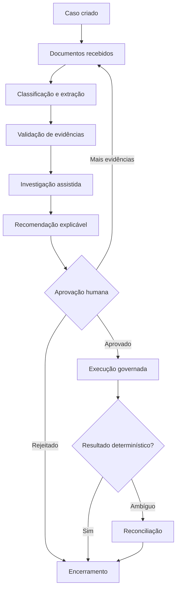
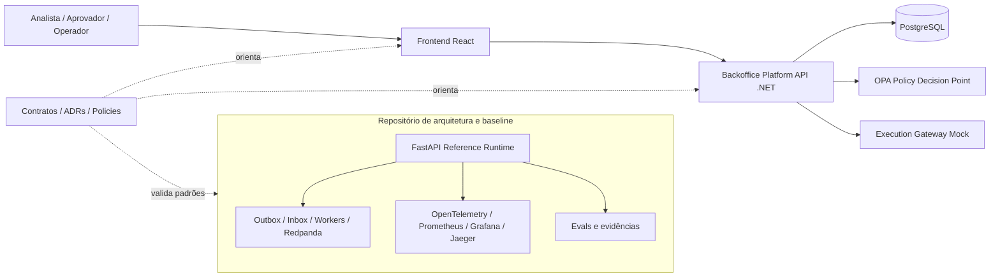
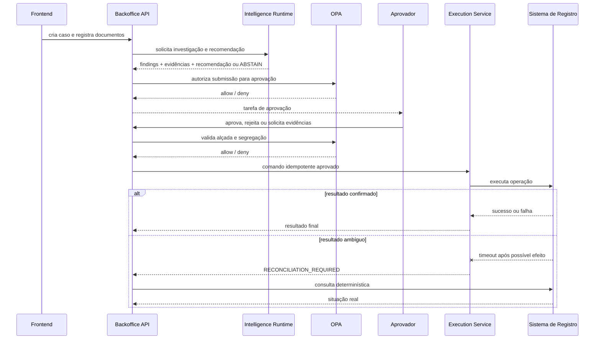

# Case aplicado — Intelligent Backoffice para contestação bancária

[📘 Abrir documentação publicada do Intelligent Backoffice](https://leandrosflora.github.io/intelligent-backoffice-platform-architecture/){ .md-button .md-button--primary target="_blank" }

[Arquitetura no GitHub](https://github.com/leandrosflora/intelligent-backoffice-platform-architecture){ .md-button target="_blank" }
[Backend .NET](https://github.com/leandrosflora/backoffice-platform-api){ .md-button target="_blank" }
[Frontend React](https://github.com/leandrosflora/intelligent-backoffice-frontend){ .md-button target="_blank" }

Este caso demonstra como as capacidades da Enterprise AI Platform Reference Architecture podem ser aplicadas a um processo de backoffice regulado, documental e de longa duração.

A jornada escolhida é uma **contestação bancária**, envolvendo documentos, investigação, recomendação, aprovação por alçada, execução governada, tratamento de resultado ambíguo e auditoria.

!!! info "Estado atual"
    A arquitetura, os contratos e os controles possuem uma baseline executável com dados sintéticos. O backend .NET e o frontend React começaram a materializar o produto em repositórios separados. A integração conjunta ainda não está classificada como validada e a solução permanece `NOT_PRODUCTION_READY`.

## Problema de negócio

Processos de contestação normalmente atravessam diferentes áreas, documentos e sistemas. Parte da análise permanece manual, os handoffs são difíceis de rastrear e uma decisão incorreta pode gerar impacto financeiro, regulatório e reputacional.

Os principais problemas tratados pelo caso são:

- tempo elevado para reunir e validar evidências;
- retrabalho causado por documentos incompletos;
- investigação distribuída entre diferentes sistemas;
- decisões inconsistentes ou pouco explicáveis;
- dificuldade de aplicar alçada e segregação de funções;
- risco de execução duplicada;
- falta de tratamento explícito para resultados financeiros ambíguos;
- evidências fragmentadas entre logs, bancos e processos manuais.

## Outcome esperado

A plataforma organiza a contestação como uma jornada governada e mensurável:

| Outcome | Indicador sugerido |
|---|---|
| Reduzir tempo de ciclo | tempo entre criação e encerramento do caso |
| Reduzir retrabalho documental | percentual de casos com solicitação de complemento |
| Melhorar consistência | divergência entre recomendação, aprovação e regra aplicável |
| Aumentar rastreabilidade | percentual de decisões com evidências, versões e actor registrados |
| Evitar efeito duplicado | conflitos e replays bloqueados por idempotência |
| Tratar incerteza operacional | tempo para reconciliar execuções ambíguas |
| Controlar autonomia da IA | percentual de abstention, revisão humana e policy denials |

## Jornada aplicada

A autoridade sobre o processo permanece no workflow. A IA atua em análise e recomendação, mas não controla o lifecycle, não aprova e não executa efeitos financeiros.

## Onde a IA entra

A IA está posicionada em três capacidades principais.

### 1. Document Intelligence

Recebe documentos como conteúdo não confiável e pode executar:

- OCR;
- classificação documental;
- extração de campos;
- identificação de inconsistências;
- avaliação de confiança;
- transformação de extrações em evidências versionadas.

A saída esperada não é uma decisão, mas um conjunto estruturado de evidências, com origem, localização, confiança, versão do modelo e versão do pipeline.

### 2. Investigation Agent

Reúne evidências e consulta ferramentas governadas, por exemplo:

- transação contestada;
- histórico do cliente;
- autenticações e dispositivos;
- sinais antifraude;
- disputas anteriores;
- dados de estabelecimento;
- regras e conhecimento aprovados.

As ferramentas devem ser mediadas por um Tool Gateway ou camada equivalente, com allowlist, tenant, finalidade, timeout, minimização de dados, policy e auditoria.

### 3. Decision Support Agent

Produz uma recomendação estruturada contendo:

- outcome sugerido;
- justificativa;
- confiança;
- evidências utilizadas;
- regras consideradas;
- versão de modelo e prompt;
- `ABSTAIN` quando o grounding for insuficiente.

A recomendação segue para policy enforcement e aprovação humana. Ela não altera diretamente o estado do caso.

## O que permanece determinístico

| Responsabilidade | Por que não deve depender de IA generativa |
|---|---|
| Lifecycle do caso | transições e estados precisam ser previsíveis e auditáveis |
| Concorrência e versionamento | conflitos devem ser detectados de forma objetiva |
| Idempotência | repetição da mesma solicitação não pode gerar novo efeito |
| Alçada e segregação | autorização é uma regra formal |
| Policy enforcement | decisões de acesso devem ser explícitas e fail-closed |
| Aprovação final | responsabilidade humana para ação sensível |
| Execução financeira | efeito mutável deve usar serviço de domínio governado |
| Reconciliação | confirmação deve vir de evidência objetiva do sistema de registro |
| Outbox e Inbox | entrega e deduplicação são mecanismos de infraestrutura |

## Situação real da inteligência

A solução já possui os contratos, os pontos de extensão e os controles para IA, mas a implementação atual ainda utiliza mecanismos determinísticos em partes da jornada.

| Capacidade | Baseline executável | Backend de produto | Evolução de IA |
|---|---|---|---|
| Classificação documental | regras por metadados e nome do arquivo | registro documental e evidências | OCR e modelo documental real |
| Investigação | engine determinística baseada em evidências | `InvestigationEngine` determinístico | agente com tools governadas |
| Recomendação | `APPROVE` ou `ABSTAIN` por regra | `RecommendationEngine` determinístico | Decision Support Agent com grounding |
| Model Gateway | definido na arquitetura-alvo | ainda não implementado | gateway provider-agnostic |
| Knowledge Service | responsabilidade arquitetural | ainda não integrado ao produto | busca híbrida e conhecimento aprovado |
| Evals | dataset e thresholds na baseline | ainda não conectados ao backend .NET | evals offline e online por modelo e prompt |

!!! warning "IA real ainda é uma evolução"
    O caso não deve ser apresentado como uma aplicação produtiva de LLM. Hoje ele demonstra principalmente o workflow, os controles de risco, a separação de responsabilidades e os contratos necessários para incorporar modelos reais com segurança.

## Mapeamento para a Enterprise AI Platform

| Capacidade de referência | Materialização no caso | Estado atual |
|---|---|---|
| Channel / Experience | console React para criar e operar casos | `IMPLEMENTATION_STARTED` |
| Agent Gateway | entrada ainda concentrada na API; gateway dedicado é evolução | `TARGET_DEFINED` |
| Agent Runtime | investigação e recomendação como módulos determinísticos | baseline `DEMONSTRATED_LOCAL`; produto `IMPLEMENTATION_STARTED` |
| Model Gateway | interface recomendada para acesso provider-agnostic | `TARGET_DEFINED` |
| Knowledge Service | conhecimento e regras como fontes aprovadas da investigação | `TARGET_DEFINED` |
| MCP / Tool Execution | tools governadas previstas para consultas de investigação | `CONTRACT_DEFINED` |
| Workflow Orchestration | lifecycle persistente, versão, timers e transições | `DEMONSTRATED_LOCAL` na baseline |
| Policy Enforcement | OPA externo, default deny, alçada, propósito e segregação | `DEMONSTRATED_LOCAL` na baseline; iniciado no backend |
| Human Approval | aprovação, rejeição e pedido de evidências | `DEMONSTRATED_LOCAL` |
| Governed Execution | execução mock idempotente e reconciliação | `DEMONSTRATED_LOCAL` |
| Event Backbone | Outbox, Inbox, workers, retry, DLQ e replay | `DEMONSTRATED_LOCAL` na baseline |
| Evidence and Audit | timeline, versões, eventos e referências de evidência | `DEMONSTRATED_LOCAL` |
| Evaluation Service | evals de classificação, grounding e abstention | `DEMONSTRATED_LOCAL` na baseline |
| Observability | métricas, traces, dashboards, SLOs e alertas | `DEMONSTRATED_LOCAL` na baseline |
| Workload Identity | JWT EdDSA local e target de IAM ou SPIFFE | baseline demonstrada; produto ainda usa headers de desenvolvimento |
| Supply Chain | SBOM e proveniência na baseline | `DEMONSTRATED_LOCAL` |
| FinOps | custo, tokens e budgets previstos para o Intelligence Runtime | `TARGET_DEFINED` |
| AI Catalog / Control Plane | contratos, ADRs, policies e estados versionados | `CONTRACT_DEFINED` |

## Arquitetura atual do ecossistema

A baseline FastAPI não é o backend de produto. Ela funciona como especificação executável para validar padrões, contratos e controles enquanto frontend e backend evoluem em repositórios próprios.

## Repositórios da implementação

| Repositório | Responsabilidade | Classificação |
|---|---|---|
| [intelligent-backoffice-platform-architecture](https://github.com/leandrosflora/intelligent-backoffice-platform-architecture) | arquitetura, C4, ADRs, contratos, policies, baseline executável, evals e readiness | `CONTRACT_DEFINED` e `DEMONSTRATED_LOCAL` |
| [backoffice-platform-api](https://github.com/leandrosflora/backoffice-platform-api) | backend .NET 9, domínio, PostgreSQL, OPA e APIs da jornada | `IMPLEMENTATION_STARTED` |
| [intelligent-backoffice-frontend](https://github.com/leandrosflora/intelligent-backoffice-frontend) | console React, jornada guiada e consumo das APIs | `IMPLEMENTATION_STARTED` |

## Controles demonstrados

| Risco | Controle aplicado |
|---|---|
| decisão autônoma indevida | IA apenas investiga e recomenda |
| self-approval | recomendador e aprovador devem ser distintos |
| aprovação fora de alçada | OPA verifica autoridade do aprovador |
| recomendação sem grounding | evidências obrigatórias e opção de `ABSTAIN` |
| execução duplicada | `Idempotency-Key` e hash do comando |
| retry cego após timeout | resultado ambíguo exige reconciliação |
| acesso cross-tenant | tenant em identidade, recurso e persistência |
| PDP indisponível | policy enforcement fail-closed |
| replay de evento | Inbox idempotente e replay autorizado |
| perda de evidência | timeline e referências persistidas |
| prompt injection documental | conteúdo tratado como não confiável e separado de instruções |
| acoplamento a fornecedor de modelo | Model Gateway provider-agnostic como evolução |

## Fluxo de aprovação e execução

## Evidências disponíveis

O repositório de arquitetura publica evidências para:

- walkthrough ponta a ponta;
- lifecycle e versionamento;
- policies positivas e negativas;
- segregação de funções;
- execução idempotente;
- resultado ambíguo e reconciliação;
- outbox, inbox, retry, DLQ e replay;
- evals determinísticos;
- métricas, traces, dashboards e SLOs;
- identidade assinada local;
- capacidade sintética;
- backup e restore;
- SBOM e proveniência.

[Executar o walkthrough da contestação](https://leandrosflora.github.io/intelligent-backoffice-platform-architecture/tutorials/dispute-walkthrough/){ target="_blank" }

## Estado de implementação

| Gate | Estado |
|---|---|
| Arquitetura, contratos e policies | `CONTRACT_DEFINED` |
| Baseline FastAPI | `DEMONSTRATED_LOCAL` |
| Backend .NET | `IMPLEMENTATION_STARTED` |
| Frontend React | `IMPLEMENTATION_STARTED` |
| Frontend + API + PostgreSQL + OPA em E2E cross-repo | Pendente |
| Modelo real, RAG e tools corporadas | Pendente |
| Integração com sistema financeiro real | Pendente |
| Identidade corporativa e mTLS | Pendente |
| Operação com SLOs e on-call | Pendente |
| Production readiness | `NOT_PRODUCTION_READY` |

## Próximas evoluções

### P8 — Integração de produto

1. Compose integrado para frontend, API, PostgreSQL e OPA;
2. E2E cross-repo da jornada principal;
3. compatibilidade automatizada entre OpenAPI e implementação;
4. recuperação de recomendações e aprovações por API;
5. identidade assinada no backend e login no frontend;
6. observabilidade e evidências no backend de produto.

### P9 — Intelligence Runtime

1. interfaces provider-agnostic para IA;
2. Model Gateway;
3. Document Intelligence com OCR e extração real;
4. Investigation Agent com tools governadas;
5. Decision Support Agent com grounding e `ABSTAIN`;
6. Knowledge Service e busca híbrida;
7. persistência de prompt, modelo, fontes e tool calls;
8. evals de groundedness, hallucination, seleção de tools, segurança, custo e latência;
9. visualização da investigação e recomendação no frontend.

## Lições arquiteturais

1. **IA não substitui workflow.** Processos longos, retries, timers e transições precisam de autoridade determinística.
2. **Recomendação não é autorização.** Uma saída do modelo não concede alçada nem permissão.
3. **Execução precisa ser isolada da IA.** Efeitos mutáveis passam por serviço de domínio, policy e idempotência.
4. **Incerteza operacional precisa de estado próprio.** Timeout após possível efeito não é sucesso nem falha segura.
5. **Evidência deve nascer junto com a decisão.** Reconstruir justificativas depois é insuficiente para auditoria.
6. **A arquitetura precisa declarar o que ainda é mock.** Código determinístico não deve ser confundido com IA real.
7. **Baseline e produto podem evoluir em trilhas separadas.** A baseline valida padrões enquanto os repositórios de produto incorporam os controles progressivamente.

## Referências

- [Documentação completa do Intelligent Backoffice](https://leandrosflora.github.io/intelligent-backoffice-platform-architecture/)
- [Case aplicado de contestação](https://leandrosflora.github.io/intelligent-backoffice-platform-architecture/case-study/)
- [Estado atual × alvo](https://leandrosflora.github.io/intelligent-backoffice-platform-architecture/architecture/implementation-status/)
- [Repositórios de implementação](https://leandrosflora.github.io/intelligent-backoffice-platform-architecture/implementation/product-repositories/)
- [ADRs do caso](https://leandrosflora.github.io/intelligent-backoffice-platform-architecture/decisions/)
- [Production readiness](https://leandrosflora.github.io/intelligent-backoffice-platform-architecture/governance/production-readiness/)
