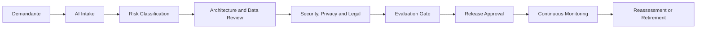

# Enterprise AI Governance Framework

## Objective

Defining how the organization decides, approves, publishes, monitors and removes AI solutions with clear responsibilities and auditory evidence.

## Operational model

## Decision-making structure

| Papel | Responsabilidade |
|---|---|
| Business Owner | purpose, benefit, impact and acceptance of residual risk |
| Product Owner | backlog, metrics and user experience |
| AI Architect | standards, architecture, autonomy and integration |
| Data Owner | quality, access, purpose and data retention |
| Security | threat model, controls and incident response |
| Privacy / DPO | LGPD, legal basis, minimization and rights of the holder |
| Legal / Compliance | regulatory, contractual obligations and intellectual property |
| Model Risk/ Evaluation | methodology, datesets, thresholds and independence of assessment |
| Platform Team | guardrails, gateways, observability and policy as code |
| Operations | SLO, runbook, capacity, continuity and rollback |

## Governed artifacts

- IA use case, purpose and Outcome Card;
- Agent Card ou Model Card;
- risk assessment;
- Architectural ADRs and model selection;
- data sources, date contracts and lineage;
- datesets, prompts, models, embeddings, tools and versioned policies;
- knowledge snapshot and release manifest;
- golden dataset and evaluation report;
- threat model and privacy assessment;
- approvals, exceptions and residual risks;
- dashboards, incidents and removal plane.

The detailed lifecycle of these assets is in [Data, Model, Prompt and Knowledge Lifecycle](model-lifecycle.md).

## Gates

| Gate | Entry | Departure |
|---|---|---|
| Intake | problem and sponsor | case registered and owner defined |
| Risk | impact, data and autonomy | LOW to CRITICAL classification |
| Design | architecture and contracts | ADRs and defined controls |
| Assurance | security, privacy, legal and evaluation | Evidence and pending |
| Release | readiness operacional | approved and unchanged version |
| Operate | telemetry and feedback | monitoring and corrective actions |
| Withdraw | closure decision | revoked access, data processed and preserved evidence |

## Alinhamento a frameworks

| Reference | Implementation |
|---|---|
| NIST AI RMF | Govern, Map, Measure and Manage as a risk cycle |
| ISO/IEC 42001 | AI management system, roles, controls and continuous improvement |
| ISO 27001 | Information security controls |
| LGPD | purpose, need, transparency, security and rights of the holder |
| EU AI Act | risk classification and proportional obligations where applicable |
| OWASP LLM | threat model and safety tests for LLM applications |

The relationship above is conceptual, and the operational traceability between control, normative function, evidence, owner, gate and enforcement is in the [Crosswalk of Governance, Risk and Compliance](compliance-crosswalk.md).

## Control traceability

Each applicable control shall have:

- stable identifier;
- reference to the treated risk;
- owner and approver where applicable;
- minimum evidence;
- gate where it is verified;
- automatic, human or hybrid enforcement;
- exception rule and expiration;
- efficacy indicator.

Documentation without evidence or enforcement is not considered implemented control.

## Exceptions

Exceptions must include:

- control not met and justification;
- residual risk and impact;
- compensatory control;
- owner and independent approver;
- expiry date;
- condition of withdrawal;
- evidence and traceable ticket.

Exception without expiry date is invalid.

## Policy as code

Automate objective controls:

- blocking artifact without owner or classification;
- prevent a model, source or tool from being approved;
- require assessment and thresholds by risk level;
- validate function segregation;
- implement budgets, quotas and autonomy limits;
- maintain unchanged published versions;
- denying by pattern when there is no policy.

## Governance indicators

- approval time by risk level;
- percentage of solutions with complete evidence;
- crosswalk control coverage;
- automated versus manual controls;
- exceptions opened and expired;
- regressions and incidents per version;
- assessment coverage and red-team;
- time for rollback or deactivation;
- percentage of models, prompts and tools out of the standard;
- cost per case of use and per task completed.
