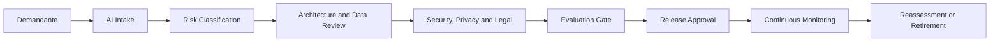

# Enterprise AI Governance Framework

## Objetivo

Definir como a organização decide, aprova, publica, monitora e retira soluções de IA com responsabilidades claras e evidências auditáveis.

## Modelo operacional

## Estrutura de decisão

| Papel | Responsabilidade |
|---|---|
| Business Owner | finalidade, benefício, impacto e aceite do risco residual |
| Product Owner | backlog, métricas e experiência do usuário |
| AI Architect | padrões, arquitetura, autonomia e integração |
| Data Owner | qualidade, acesso, finalidade e retenção dos dados |
| Security | threat model, controles e resposta a incidentes |
| Privacy / DPO | LGPD, base legal, minimização e direitos do titular |
| Legal / Compliance | obrigações regulatórias, contratuais e propriedade intelectual |
| Model Risk / Evaluation | metodologia, datasets, thresholds e independência da avaliação |
| Platform Team | guardrails, gateways, observabilidade e policy as code |
| Operations | SLO, runbook, capacidade, continuidade e rollback |

## Artefatos governados

- AI use case e finalidade;
- Agent Card ou Model Card;
- risk assessment;
- ADRs de arquitetura e seleção de modelo;
- fontes de dados e lineage;
- prompts, modelos, ferramentas e políticas versionados;
- golden dataset e evaluation report;
- threat model e privacy assessment;
- aprovações, exceções e riscos residuais;
- dashboards, incidentes e plano de retirada.

## Gates

| Gate | Entrada | Saída |
|---|---|---|
| Intake | problema e sponsor | caso registrado e owner definido |
| Risk | impacto, dados e autonomia | classificação LOW a CRITICAL |
| Design | arquitetura e contratos | ADRs e controles definidos |
| Assurance | security, privacy, legal e evaluation | evidências e pendências |
| Release | readiness operacional | versão aprovada e imutável |
| Operate | telemetria e feedback | monitoramento e ações corretivas |
| Retire | decisão de encerramento | acesso revogado, dados tratados e evidência preservada |

## Alinhamento a frameworks

| Referência | Aplicação |
|---|---|
| NIST AI RMF | Govern, Map, Measure e Manage como ciclo de risco |
| ISO/IEC 42001 | sistema de gestão de IA, papéis, controles e melhoria contínua |
| ISO 27001 | controles de segurança da informação |
| LGPD | finalidade, necessidade, transparência, segurança e direitos do titular |
| EU AI Act | classificação por risco e obrigações proporcionais quando aplicável |
| OWASP LLM | threat model e testes de segurança para aplicações com LLM |

## Exceções

Exceções devem possuir:

- controle não atendido e justificativa;
- risco residual e impacto;
- controle compensatório;
- owner e aprovador independente;
- prazo de validade;
- condição de revogação;
- evidência e ticket rastreável.

Exceção sem data de expiração é inválida.

## Policy as code

Automatizar controles objetivos:

- bloquear artefato sem owner ou classificação;
- impedir modelo, fonte ou ferramenta não aprovada;
- exigir avaliação e thresholds por nível de risco;
- validar segregação de função;
- aplicar budgets, quotas e limites de autonomia;
- manter versões publicadas imutáveis;
- negar por padrão quando não houver política.

## Indicadores de governança

- tempo de aprovação por nível de risco;
- percentual de soluções com evidências completas;
- exceções abertas e vencidas;
- regressões e incidentes por versão;
- cobertura de avaliação e red-team;
- tempo para rollback ou desativação;
- percentual de modelos, prompts e ferramentas fora do padrão;
- custo por caso de uso e por tarefa concluída.
