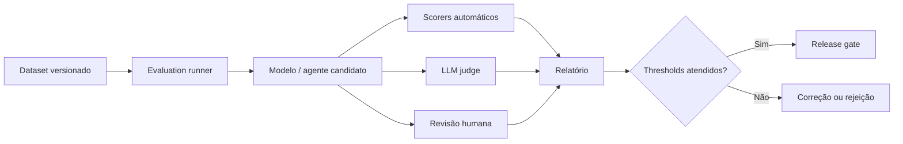

# AI Evaluation Framework

## Objective

Establishing a reproducible approach to assess quality, safety, cost and impact of AI solutions before and after publication.

## Evaluation layers

| Camada | Main question | Examples of metrics |
|---|---|---|
| component | Does retriever, prompt, model or tool work in isolation? | recall@k, precision@k, schema validity, tool success |
| System | Does the application deliver a correct and safe response tip by tip? | groundedness, answer relevance, task success, toxicity |
| Operation | Does the service meet SLO and budget? | latency, error, tokens, cost, availability |
| Business | Does the case of use generate the expected result? | conversion, saved time, resolution, satisfaction |

## Types of assessment

### Offline

Performed on dataset versioned before deploy. It must compare candidate, baseline and production version.

### Online

Performed with controlled traffic, shadow mode, canary or A/B test. Business metrics do not replace security tests.

### Humana

It is used when automatic criteria do not capture contextual accuracy, usefulness, tone or impact. Evaluators need calibrated headings and examples.

### LLM-as-judge

Suitable for scale and relative comparison, but it should not be the only evidence for HIGH and CRITICAL risks. The judge should be versed, calibrated against humans and protected against contamination by the evaluated content.

## Golden dataset

Each case of use must keep a set versioned with:

- happy paths;
- borderline cases;
- questions without answers;
- adverse content;
- groups and relevant languages;
- known failures and previous incidents;
- tool calls allowed and prohibited;
- citation expectancy and source.

## Recommended metrics

| Dimension | Metrics |
|---|---|
| RAG | context recall, context precision, groundedness, citation correctness |
| Response | relevance, completeness, factuality, format compliance |
| Security | attack success rate, leakage rate, toxicity, policy violation |
| Agents | task success, tool selection accuracy, loop rate, unauthorized action rate |
| Operation | p50/p95/p99, error rate, tokens, cost per successful task |
| Responsible AI | disparity by segment, contestation, human override |

## Pipeline

## Release gates

Deploy should be blocked when:

- there is regression above tolerance;
- any critical safety test fails;
- schema of outflow or tool contract is invalid;
- projected cost exceeds budget;
- dataset, prompt, model or policy is not versioned;
- obligatory evidence is not reproducible.

## Continuous monitoring

Production should feed new cases for regression; incidences, negative assessments, corrected responses and changes in sources should generate new tests.

## Minimum report

- versions of model, prompt, policy and dataset;
- environment and parameters;
- metrics, thresholds and comparison with baseline;
- failures conhecidas;
- result of adverse tests;
- approval decision;
- residual risks and monitoring plan.
