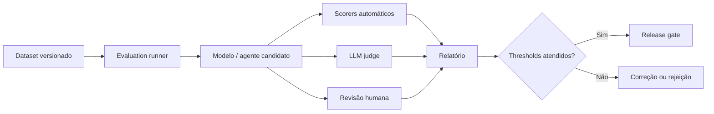

# AI Evaluation Framework

## Objet

Establish a reprodutable approach to assess quality, safety, cost and impact of IA solutions before and after publication.

## Assessment calls

| Camada | Main question | Methods |
|---|---|---|
| Componente | The retriever, prompt, model or tool works alone? | recall@k, precision@k, schema validity, tool success |
| Sistema | The application delivers a correct answer and secures the point? | groundedness, answer relevance, task success, toxicity |
| Operation | The service at SLO and budget? | ltability, error, tokens, cost, availability |
| Negocio | The use case generates the result sucked? | converse, economised time, resolution, satisfaction |

## Assessment tips

### Offline

Executed on versioned dataset before deployment.

### Online

- Executed with controlled traffic, shadow mode, canary or A/B test. Business methods do not replace security tests.

### Humana

Used when automatician criteria do not require contextual, utilitarian, tom or impact. Assessments need rubrics and calibrated examples.

### LLM-as-judge

Adequate for a relative scale and comparison, but it must not be the only evidence for high and criterion risks. The judge must be drafted, calibrated against humans and protected against contamination by the evidence evaluated.

## Golden dataset

Each use case shall maintain a set version with:

- happy paths;
- limothrofe cases;
- questions without answers;
- a conflicting content;
- grupos e idiomas relevantes;
- falhas conhecidas e incidentes anteriores;
- tool calls permitidas e proibidas;
- a citation and source expectancy.

## recommendated methods

| Dimensive | Mechanics |
|---|---|
| RAG | context recall, context precision, groundedness, citation correctness |
| Resposta | relevance, completeness, factuality, format compliance |
| Security | attack success rate, leakage rate, toxicity, policy violation |
| Agents | task success, tool selection accuracy, loop rate, unauthorized action rate |
| Operation | p50/p95/p99, error rate, tokens, cost per successful task |
| Responsible AI | disparity by segment, contest, human override |

## Pipeline

## Release gates

The deployment must be blocked when:

- there is a return to tolerance;
- any critical security test fail;
- the exit schema or tool contract is ineffective;
- custo projetado exceder budget;
- dataset, prompt, model or policy not compiled;
- Obligatory evidence is not reproduced.

## Contingency monitoring

Production must feed new cases for return. Inaccidents, negative assessments, corrected responses and changes in sources must generate new tests.

## Minimum report

- models, prompt, policy and dataset;
- environment and parasols;
- methods, thresholds and comparison with baseline;
- falhas conhecidas;
- result of adversarial tests;
- a decision of approval;
- Waste risk and monitoring plan.
