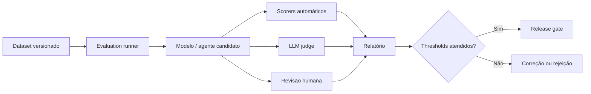

# AI Evaluation Framework

## Objective

Establish a reproducible approach to evaluate the quality, safety, cost and impact of AI solutions before and after publication.

## Layer of evaluation

| Layer | The main issue | Examples of metrics |
|---|---|---|
| Component | Does the retriever, prompt, model or tool work in isolation? | recall@k, precision@k, schema validity, tool success |
| Sistema | Does the application deliver a correct and secure end-to-end response? | groundedness, answer relevance, task success, toxicity |
| Operations | Does the service meet SLO and budget? | The following information is included in the calculation: |
| Business | Does the use case produce the desired result? | The Commission shall adopt delegated acts in accordance with Article 21 of Regulation (EU) No 1303/2013. |

## Types of evaluation

### Offline

It must compare candidate, baseline and production version.

### Online

Running with controlled traffic, shadow mode, canary or A/B testing.

### Humana

Used when automatic criteria do not capture contextual accuracy, utility, tone or impact.

### LLM-as-judge

Appropriate for scale and relative comparison, but should not be the only evidence for HIGH and CRITICAL risks.

## Golden dataset

Each use case shall maintain a versioned set with:

- happy paths;
- boundary cases;
- unanswered questions
- adverse content;
- relevant groups and languages;
- known failures and previous incidents;
- permitted and prohibited tool calls;
- Expectation of citation and source.

## Recommended metrics

| Size | The following information shall be provided: |
|---|---|
| RAG | context recall, context precision, groundedness, citation correctness |
| Resposta | relevance, completeness, factuality, format compliance |
| Security | attack success rate, leakage rate, toxicity, policy violation |
| Agents | task success, tool selection accuracy, loop rate, unauthorized action rate |
| Operations | p50/p95/p99, error rate, tokens, cost per successful task |
| Responsible AI | The Commission shall adopt delegated acts in accordance with Article 21 of Regulation (EU) No 182/2011 and in accordance with Article 21 thereof. |

## Pipeline

## Release gates

The deployment shall be blocked when:

- there is a regression above tolerance;
- failure of any critical safety test;
- the output scheme or tool contract is invalid;
- custo projetado exceder budget;
- the dataset, prompt, template or policy is not versioned;
- compulsory evidence is not reproducible.

## Continuous monitoring

Production should fuel new cases for regression. Incidents, negative assessments, corrected responses and changes in sources should generate new testing.

## Minimum reporting

- template, prompt, policy and dataset versions;
- environment and parameters;
- metrics, thresholds and comparison with baseline;
- falhas conhecidas;
- the result of the adverse test;
- the approval decision;
- residual risks and monitoring plan.
