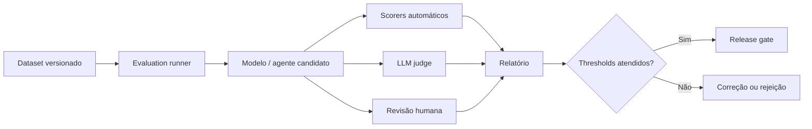

# AI Evaluation Framework

## Objetivo

Estabelecer uma abordagem reproduzível para avaliar qualidade, segurança, custo e impacto de soluções de IA antes e depois da publicação.

## Camadas de avaliação

| Camada | Questão principal | Exemplos de métricas |
|---|---|---|
| Componente | O retriever, prompt, modelo ou ferramenta funciona isoladamente? | recall@k, precision@k, schema validity, tool success |
| Sistema | A aplicação entrega resposta correta e segura ponta a ponta? | groundedness, answer relevance, task success, toxicity |
| Operação | O serviço atende SLO e orçamento? | latência, erro, tokens, custo, disponibilidade |
| Negócio | O caso de uso gera o resultado esperado? | conversão, tempo economizado, resolução, satisfação |

## Tipos de avaliação

### Offline

Executada em dataset versionado antes do deploy. Deve comparar candidato, baseline e versão em produção.

### Online

Executada com tráfego controlado, shadow mode, canary ou A/B test. Métricas de negócio não substituem testes de segurança.

### Humana

Usada quando critérios automáticos não capturam precisão contextual, utilidade, tom ou impacto. Avaliadores precisam de rubrica e exemplos calibrados.

### LLM-as-judge

Adequado para escala e comparação relativa, mas não deve ser a única evidência para riscos HIGH e CRITICAL. O judge deve ser versionado, calibrado contra humanos e protegido contra contaminação pelo conteúdo avaliado.

## Golden dataset

Cada caso de uso deve manter um conjunto versionado com:

- happy paths;
- casos limítrofes;
- perguntas sem resposta;
- conteúdo adversarial;
- grupos e idiomas relevantes;
- falhas conhecidas e incidentes anteriores;
- tool calls permitidas e proibidas;
- expectativa de citação e fonte.

## Métricas recomendadas

| Dimensão | Métricas |
|---|---|
| RAG | context recall, context precision, groundedness, citation correctness |
| Resposta | relevance, completeness, factuality, format compliance |
| Segurança | attack success rate, leakage rate, toxicity, policy violation |
| Agentes | task success, tool selection accuracy, loop rate, unauthorized action rate |
| Operação | p50/p95/p99, error rate, tokens, cost per successful task |
| Responsible AI | disparidade por segmento, contestação, override humano |

## Pipeline

## Release gates

O deploy deve ser bloqueado quando:

- houver regressão acima da tolerância;
- qualquer teste crítico de segurança falhar;
- schema de saída ou tool contract estiver inválido;
- custo projetado exceder budget;
- dataset, prompt, modelo ou política não estiver versionado;
- evidências obrigatórias não forem reproduzíveis.

## Monitoramento contínuo

Produção deve alimentar novos casos para regressão. Incidentes, avaliações negativas, respostas corrigidas e mudanças nas fontes devem gerar novos testes.

## Relatório mínimo

- versões de modelo, prompt, política e dataset;
- ambiente e parâmetros;
- métricas, thresholds e comparação com baseline;
- falhas conhecidas;
- resultado dos testes adversariais;
- decisão de aprovação;
- riscos residuais e plano de monitoramento.
