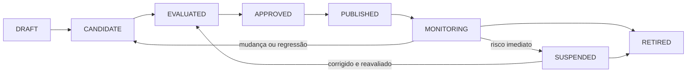
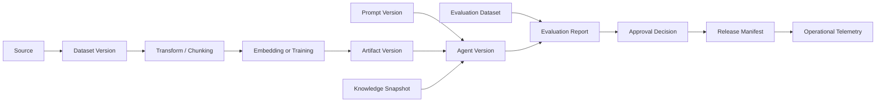

# Data, Model, Prompt and Knowledge Lifecycle

## Objective

Defining how data, datesets, models, prompts, embeddings and snapshots of knowledge are registered, evaluated, promoted, monitored, altered and removed with traceability point by point.

The lifecycle exists to prevent a version of the agent from being published without knowing how to do so. **which assets were used, who approved them, how they were evaluated and how they can be reversed or eliminated.**.

## Escopo governado

| Tipo de ativo | Examples | Minimum identity |
|---|---|---|
| Data source | bucket, bank, API, document repository |  `sourceId`, owner, purpose, classification, region |
| Dataset | training, evaluation, red-team, golden dataset |  `datasetId`, version, hash, period, lineage |
| Model | foundation model, fine-tune, embedding, reranker |  `modelId`, provider, effective version, region, status |
| Prompt | system prompt, template, few-shot examples |  `promptId`Version, hash, owner, compatibility |
| Knowledge snapshot | Documents, chunks, index and ACLs |  `knowledgeBaseId`, snapshot, embedding version, checksum |
| Policy | authorisation, guardrail, routing, budget |  `policyId`, version, decision and environment |
| Tool contract | MCP tool, OpenAPI or asynchronous command | name, version, risk, scopes and scheme |

## Central principle

A published version of the staff member shall point to a set of **immutable and reproducible** de ativos:

```text
agentVersion
  ├─ code/build
  ├─ promptVersion
  ├─ modelPolicyVersion
  ├─ modelVersion or provider alias resolved
  ├─ toolContractVersions
  ├─ policyVersions
  ├─ knowledgeSnapshot
  ├─ embeddingVersion
  ├─ evaluationDatasetVersion
  └─ approvalDecision
```

Operational aliases can be used for routing, but the effective version should be registered in traces, events and reports.

## Canonical States



| State | Meaning |
|---|---|
|  `DRAFT`  | assets under construction, not yet eligible for formal assessment |
|  `CANDIDATE`  | frozen version for evaluation |
|  `EVALUATED`  | results and limitations known |
|  `APPROVED`  | authorised for scope, environment and deadline |
|  `PUBLISHED`  | available for controlled consumption |
|  `MONITORING`  | version in operation with metrics and active triggers |
|  `SUSPENDED`  | temporarily blocked by risk, incident or regression |
|  `RETIRED`  | version out of use, with revoked access and treated retention |

Approval belongs to the version. Material modification generates a new version and a new impact proportional assessment.

## Identity and versioning

Every governed asset shall register:

```yaml
assetType: PROMPT
assetId: policy-assistant-system
version: 2.3.0
contentHash: sha256:...
owner: credit-ai-team
status: APPROVED
createdAt: 2026-07-22T10:00:00Z
approvedAt: 2026-07-23T15:00:00Z
approvedFor:
  environments: [staging, production]
  riskLevels: [LOW, MEDIUM]
compatibility:
  agentVersions: [1.4.x]
  modelCapabilities: [TEXT_GENERATION, TOOL_CALLING]
lineage:
  derivedFrom: policy-assistant-system@2.2.1
changeTicket: AI-1842
```

### Regras

- published versions are unchangeable;
- hashes identify the effective content, not only the logical name;
- semantic changes use new version;
- rollback selects a known version without editing production;
- aliases must resolve for a version and record the resolution;
- unapproved assets cannot be referred to by published versions.

## Lineage ponta a ponta

O lineage deve responder:

- where were the data from?
- what transformations have been executed?
- which version of the model or embedding was used?
- quais prompts e policies participaram?
- which dates evaluated the version?
- qual release consumiu o ativo?
- which users, processes or decisions have been impacted?



## Lifecycle of data and dates

### Source Onboarding

Before ingestion, record:

- owner and source system;
- permitted purpose;
- classification and data categories;
- legal basis and contractual restrictions where applicable;
- residence and international transfer;
- expected quality and SLA of source;
- retention, exclusion and rights of the holder;
- revocation mechanism.

### Preparation and processing

Transformations need to be reproducible and versioned:

- extraction, parsing and OCR;
- cleaning and standardisation;
- deduplication;
- masking or anonymization;
- ACL classification and propagation;
- chunking;
- rotulagem;
- generating synthetic examples;
- training, validation and test split.

Synthetic data do not eliminate the need to assess privacy, representativeness and provenance.

### Quality of dates

| Dimension | Examples of control |
|---|---|
| Completude | mandatory fields and scenario coverage |
| Validade | schemas, formatos e ranges |
| Representatividade | segmentos, idiomas, canais e edge cases |
| Atualidade | period, frequency and cutoff date |
| Consistency | duplicidades, conflitos e labels divergentes |
| Privacidade | minimizing, masking and segregation |
| Security | origem aprovada, malware e poisoning |
| Leakage | separation between training, evaluation and production |

### Change and exclusion

A change in source, purpose, scheme, period or policy may invalidate dates and derivatives. Exclusion should reach copies, chunks, embeddings, caches and derivatives when required by policy.

## Lifecycle of models

### Descoberta e cadastro

A candidate model shall record:

- provider, family, version and region;
- capabilities and limitations;
- data policy and supplier retention;
- context window e formatos suportados;
- compatibilidade de tool calling;
- cost and limits;
- support status and depreciation plan;
- independent and internal assessments are available.

### Evaluation

Avaliar separadamente:

- quality per task;
- security and resistance to attacks;
- privacidade e data handling;
- latency and availability;
- cost per completed task;
- compatibilidade com prompts, tools e formatos;
- behavior by language, segment and critical scenario.

### Approval and publication

Approval shall limit:

- cases of use and risk classification;
- environments and regions;
- types of data allowed;
- authorised capacity;
- token limits, cost and competition;
- fallback permitido;
- deadline and re-evaluation triggers.

The Model Gateway applies the policy. Runtimes do not freely choose models outside the approved set.

### Monitoring and depreciation

Monitoring quality, safety, latency, cost, fallback, changes in provider and discontinuation. A silent change in supplier alias should be detected by the effective version registered.

## Lifecycle de prompts

Prompts are software and policy artifacts, not informal text.

### Governed content

- system instructions;
- templates and variables;
- few-shot examples;
- non-reliable content delimiters;
- instructions for use;
- mensagens de fallback e recusa;
- Reference rules and transparency.

### Material changes

Require new version and evaluation:

- change of objective or behavior;
- change in autonomy limits;
- inclusion of new tool or source;
- removal of safety instructions;
- change in output format;
- relevant change of examples;
- adaptation to new model or language.

### Minimum tests

- golden cases;
- conflicting instructions;
- prompt injection direta e indireta;
- missing or ambiguous data;
- invalid arguments of tool;
- output schema;
- cost regression and tokens;
- comparison with the previous version.

## Lifecycle de embeddings e knowledge snapshots

Embeddings should register model, version, dimension, normalization, chunking and generation date.Exchange of embedding model usually requires new snapshot and re-indexation.

A knowledge snapshot must be unchangeable and contain:

- documentos e checksums;
- versions of chunks;
- ACL, classification, purpose and retention;
- embedding version;
- index or publishing alias;
- retrieval metrics;
- documents excluded or quarantine.

Promotion of snapshot uses alias or equivalent mechanism, Rollback returns to known snapshot without emergency reconstruction.

## Evaluation datasets e baselines

Assessment dates are separated from training data and from examples used in the prompt.

Each date shall bear:

- owner and domain;
- version and hash;
- origin and period;
- inclusion criteria;
- labels, rubricas e reviewers;
- risk coverage and edge cases;
- validity and date of review;
- access restrictions and retention.

Possible basis:

- previous version
- current human process;
- deterministic workflow;
- simpler or cheaper model;
- minimum approved threshold.

## Promotion networks

| Gate | Pergunta | Evidence |
|---|---|---|
| G0 — Register | the asset has identity and owner? | registration, purpose and classification |
| G1 — Prepare | lineage and transformations are reproducible? | manifests, code and hashes |
| G2 — Evaluate | quality, safety, cost and performance were measured? | evaluation report e testes negativos |
| G3 — Approve | were residual risk and scope accepted? | Decision, conditions and validity |
| G4 — Publish | are version and dependencies immutable and reversible? | release manifest, assinatura e rollback |
| G5 — Operate | are metrics, alerts and budgets active? | dashboards, SLOs e quotas |
| G6 — Reassess / Retire | were treated? | novo bundle ou retirement record |

## Drift and re-evaluation triggers

| Tipo | Sinal | Example of action |
|---|---|---|
| Data drift | distribution or schema changed | blocking intake, recalibrating dates |
| Concept drift | relationship between entry and result has changed | review rule, prompt or model |
| Model drift | quality or safety decreased | exchange version, fallback or suspend |
| Prompt drift | accumulated changes altered the behavior of the patients. | consolidate version and implement regression |
| Retrieval drift | recall, relevance or citations worsened | reindexar, ajustar chunking ou reranker |
| Cost drift | cost per task exceeded baseline | reduce context, routing model or block |
| Outcome drift | technical metric is good, but value has fallen | review product, process or discontinue |
| Regulatory drift | obligation or purpose has changed | reclassify risk and repeat assurance |

### Gatilhos materiais

- change of model or provide;
- abnormal main prompt;
- new source of data, tool or purpose;
- change of embedding, chunking or reranker;
- incident of security or privacy;
- regression above threshold;
- expiry of approval;
- regulatory or contractual change;
- relevant growth in volume, users or autonomy.

## Regression responses

A resposta deve ser proporcional ao impacto:

1. alert and open investigation;
2. reducing traffic or population;
3. disabling toool or specific capacity;
4. routing to model or anterior snapshot;
5. exigir human-in-the-loop;
6. discontinue the version;
7. retirar e revogar acessos.

## Retraining, fine-tuning e re-embedding

Retraining or fine-tuning should not be automatic only because drift has been detected. First identify cause, risk, necessary data and simpler alternative.

Quando realizado:

- freeze dateset and training code;
- register parameters, seed and environment;
- gerar novo model artifact e model card;
- repeat applicable complete assessment;
- compare with the baseline and previous version;
- usar rollout controlado;
- manter rollback independente do pipeline de treino.

Re-embedding follows the equivalent process for knowledge snapshots, with validation of retrieval and authorization before promotion.

## Evidence bundle

```text
asset-manifest.yaml
data-contracts/
lineage.json
source-snapshots/
transformation-manifest.json
model-card.md
model-policy.yaml
prompt-manifest.json
knowledge-snapshot.json
dataset-manifest.json
evaluation-report.json
security-tests.json
approval-decision.json
release-manifest.json
operational-baseline.json
change-record.json
retirement-record.json
```

## Responsabilidades

| Papel | Responsabilidade |
|---|---|
| Business Owner | residual risk outcome and acceptance |
| Data Owner | sources, quality, access, retention and exclusion |
| AI Architect | borders, compatibility and architectural decisions |
| Model Risk / Evaluation | methodology, datesets, thresholds and independence |
| Security / Privacy | threats, data, suppliers and controls |
| Platform Team | registry, manifests, policies and technical promotion |
| Product Team | prompts, experience, feedback and result metrics |
| Operations / SRE | SLOs, monitoring, incidents, rollback and withdrawal |

## Integration with governance

- [Enterprise AI Governance Framework](ai-governance-framework.md)
- [Crosswalk of Governance, Risk and Compliance](compliance-crosswalk.md)
- [AI Risk Framework](ai-risk-framework.md)
- [Evaluation Framework](evaluation-framework.md)
- [ADR-007 — Hybrid and continuous evaluation](../adrs/007-evaluation-strategy.md)

## Anti-patterns

- usar `latest` without registering effective version;
- edit prompt directly into production;
- mixing training and evaluation data;
- exchange embedding without verifying the index;
- approve the model without limiting purpose, region or data;
- monitoring only availability and latency;
- keep retired assets accessible by old credentials;
- assign drift to the model without investigating data, prompt, retrieval and process.
