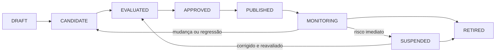
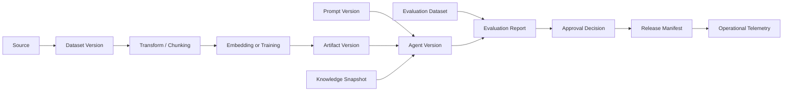

# Data, Model, Prompt and Knowledge Lifecycle

## Objective

Defining how data, datasets, models, prompts, embeddings and knowledge snapshots are recorded, evaluated, promoted, monitored, changed and retrieved with end-to-end traceability.

The lifecycle exists to prevent an agent version from being published without knowing **what assets were used, who approved them, how they were evaluated, and how they can be reversed or removed**.

## Escopo governado

| Type of asset | Examples | Minimum identity |
|---|---|---|
| The data source | bucket, banco, API, documentary repository | `sourceId`, owner, purpose, classification, region |
| Dataset | training, evaluation, red-team, golden dataset | `datasetId`, version, hash, period, lineage |
| Model | foundation model, fine-tune, embedding, reranker | `modelId`, provider, current version, region, status |
| Prompt | system prompt, template, few-shot examples | `promptId`, version, hash, owner, compatibility |
| Knowledge snapshot | The following information shall be provided for the purposes of this Regulation: | `knowledgeBaseId`, snapshot, embedding version, checksum |
| Policy | The Commission shall adopt delegated acts in accordance with Article 21 of this Regulation. | `policyId`, version, decision and environment |
| Tool contract | MCP tool, OpenAPI or asynchronous control | name, version, risk, scopes and scheme |

## The main principle

A published version of an agent shall point to a set of immutable and reproducible assets:

```text
agentVersion
  ├─ code/build
  ├─ promptVersion
  ├─ modelPolicyVersion
  ├─ modelVersion or provider alias resolved
  ├─ toolContractVersions
  ├─ policyVersions
  ├─ knowledgeSnapshot
  ├─ embeddingVersion
  ├─ evaluationDatasetVersion
  └─ approvalDecision
```

Operational aliases may be used for routing, but the version effectively executed must be recorded in traces, events and reports.

## Canonical States



| State of origin | Significado |
|---|---|
| `DRAFT` | assets under construction, not yet eligible for formal evaluation |
| `CANDIDATE` | frozen version for evaluation |
| `EVALUATED` | known outcomes and limitations |
| `APPROVED` | authorised for defined scope, environment and time |
| `PUBLISHED` | Available for controlled consumption |
| `MONITORING` | Operating version with active metrics and triggers |
| `SUSPENDED` | temporarily blocked use due to risk, incident or regression |
| `RETIRED` | Out-of-use version with revoked access and treated retention |

Approval belongs to the version. Material change generates a new version and new impact-proportionate assessment.

## Identity and versioning

All governed assets shall record:

```yaml
assetType: PROMPT
assetId: policy-assistant-system
version: 2.3.0
contentHash: sha256:...
owner: credit-ai-team
status: APPROVED
createdAt: 2026-07-22T10:00:00Z
approvedAt: 2026-07-23T15:00:00Z
approvedFor:
  environments: [staging, production]
  riskLevels: [LOW, MEDIUM]
compatibility:
  agentVersions: [1.4.x]
  modelCapabilities: [TEXT_GENERATION, TOOL_CALLING]
lineage:
  derivedFrom: policy-assistant-system@2.2.1
changeTicket: AI-1842
```

### Rules

- published versions are immutable;
- hashes identify the actual content, not just the logical name;
- semantic changes use a new version;
- rollback selects known version without editing production;
- aliases must resolve to a version and record the resolution;
- Unapproved assets cannot be referenced by published versions.

## Lineage end to end

The lineage must answer:

- Where did the data come from?
- What changes have been made?
- which version of the model or embedding was used?
- What prompts and policies were involved?
- What dataset evaluated the version?
- What release consumed the asset?
- which users, processes or decisions have been impacted?



## Lifecycle of data and datasets

### Source onboarding

Before ingestion, record:

- owner and system of origin;
- finalidade permitida;
- classification and data categories;
- legal basis and contractual restrictions where applicable;
- international residence and transfer;
- the expected quality and SLA of the source;
- the retention, exclusion and rights of the holder;
- the withdrawal mechanism.

### Preparation and processing

Transformations need to be reproducible and versioned:

- the extraction, parsing and OCR;
- cleaning and standardisation;
- the deduplication;
- masking or anonymization;
- classification and spread of ACL;
- chunking;
- rotulagem;
- the generation of synthetic examples;
- training split, validation and testing.

Synthetic data do not eliminate the need to assess privacy, representativeness and provenance.

### Quality of the dataset

| Size | Examples of controls |
|---|---|
| Completude | Mandatory fields and coverage of scenarios |
| Validade | Schemes, formats and ranges |
| Representatividade | segments, languages, channels and edge cases |
| Atualidade | period, frequency and date of cutting |
| Consistency | duplicities, conflicts and divergent labels |
| Privacidade | Minimization, masking and segregation |
| Security | approved source, malware and poisoning |
| Leakage | separation between training, evaluation and production |

### Changes and exclusions

A change in source, purpose, scheme, period or policy may invalidate derivative datasets. The deletion must reach copies, chunks, embeddings, caches and derivatives when required by the policy.

## Lifecycle of models

### Discovered and registered

An applicant model shall record:

- provider, family, version and region;
- capabilities and limitations;
- the provider's data policy and retention;
- context window and supported formats;
- the compatibility of tool calling;
- cost and limits;
- support status and depreciation plan;
- independent and internal assessments are available.

### Assessment

Avaliar separadamente:

- quality per task;
- security and attack resistance;
- privacy and data handling;
- latency and availability;
- cost per completed task;
- compatibility with prompts, tools and formats;
- the behaviour by language, segment and critical scenario.

### Approval and publication

The approval shall be limited to:

- use cases and risk classification;
- environments and regions;
- permitted data types;
- authorised capacities;
- Token limits, cost and competition;
- fallback permitido;
- the deadline and triggers for reassessment.

Model Gateway applies the policy. Runtimes do not freely choose models outside the approved set.

### Monitoring and depreciation

Monitor quality, security, latency, cost, fallback, provider changes and discontinuation. Silent change of supplier aliases shall be detected by the actual recorded version.

## Lifecycle of prompts

Prompts are software and policy artifacts, not informal text.

### Content governed

- system instructions;
- Templates and variables;
- few-shot examples;
- unreliable content delimiters;
- tool use instructions;
- fallback and refusal messages;
- rules on citation and transparency.

### Changes in the material

They require a new version and evaluation:

- change in objective or behaviour;
- change in limits of autonomy;
- the inclusion of a new tool or source;
- removal of safety instruction;
- change of output format;
- relevant change of examples;
- adaptation to a new model or language.

### Minimum tests

- golden cases;
- conflicting instructions;
- prompt injection directly and indirectly;
- missing or ambiguous data;
- Invalid tool arguments;
- output schema;
- cost and tokens regression;
- comparison with the previous version.

## Lifecycle of embeddings and knowledge snapshots

Embeddings must record model, version, size, normalization, chunking, and generation date.

A knowledge snapshot shall be immutable and shall contain:

- documents and checksums;
- chunks versions;
- ACL, classification, purpose and retention;
- embedding version;
- publication index or aliases;
- the retrieval metrics;
- excluded documents or quarantined.

Snapshot promotion uses aliases or equivalent mechanism. Rollback returns to known snapshot without emergency reconstruction.

## Evaluation datasets and baselines

Assessment datasets are separate from training data and examples used in the prompt.

Each dataset shall contain:

- owner and domain;
- version and hash;
- origin and period;
- criteria for inclusion;
- labels, headings and reviewers;
- risk coverage and edge cases;
- validity and date of review;
- restrictions on access and retention.

Baselines that are possible:

- the previous version;
- the current human process;
- deterministic workflow;
- simpler or cheaper model;
- the minimum threshold approved.

## Promotion gates

| Gate | Pergunta | Evidence |
|---|---|---|
| G0 — Register | Does the asset have identity and owner? | Registration, purpose and classification |
| G1 — Prepare | Are lineage and transformations reproducible? | Manifests, code and hashes |
| G2 — Evaluate | Have quality, safety, cost and performance been measured? | evaluation report and negative tests |
| G3 — Approve | Was the residual risk and scope accepted? | Decision, conditions and validity |
| G4 — Publish | are version and dependencies immutable and reversible? | release manifest, signature and rollback |
| G5 — Operate | Metrics, alerts and budgets are active? | dashboards, SLOsand quotas |
| G6 — Reassess / Retire | change, drift or expiration have been treated? | novo bundle ou retirement record |

## Drift and revaluation triggers

| Tipo | Sinal | Example of action |
|---|---|---|
| Data drift | distribution or schema changed | blocking intake, recalibrating the dataset |
| Concept drift | the input-outcome ratio has changed | review rule, prompt or model |
| Model drift | degraded quality or safety | change version, fallback or suspension |
| Prompt drift | cumulative changes have altered behavior | consolidate version and execute regression |
| Retrieval drift | recall, relevance or citations have deteriorated | reindexar, ajustar chunking ou reranker |
| Cost drift | Cost per task exceeded baseline | Reducing context, routing model or blocking |
| Outcome drift | Technical metrics are good, but value has dropped. | review product, process or discontinue |
| Regulatory drift | change of obligation or purpose | Reclassify risk and repeat assurance |

### Gatilhos materiais

- change of model or provider;
- change in the main prompt;
- new data source, tool or purpose;
- change of embedding, chunking or reranker;
- security or privacy incident;
- a regression above the threshold;
- the expiry of the approval;
- regulatory or contractual change;
- relevant growth in volume, users or autonomy.

## Reversal responses

The response shall be proportional to the impact:

1. alerting and opening an investigation;
2. reduce traffic or population;
3. disable a specific tool or capability;
4. rotate to a previous model or snapshot;
5. exigir human-in-the-loop;
6. suspend the version;
7. withdraw and revoke access.

## Re-training, fine-tuning and re-embedding

Retraining or fine-tuning should not be automatic just because drift has been detected. First identify cause, risk, necessary data and simpler alternative.

When carried out:

- freeze the dataset and training code;
- recording parameters, seed and environment;
- generate new model artifact and model card;
- repeat the applicable full assessment;
- comparing with baseline and previous version;
- usar rollout controlado;
- keep rollback independent of the training pipeline.

Re-embedding follows an equivalent process for knowledge snapshots, with retrieval validation and authorization prior to promotion.

## Evidence bundle

```text
asset-manifest.yaml
data-contracts/
lineage.json
source-snapshots/
transformation-manifest.json
model-card.md
model-policy.yaml
prompt-manifest.json
knowledge-snapshot.json
dataset-manifest.json
evaluation-report.json
security-tests.json
approval-decision.json
release-manifest.json
operational-baseline.json
change-record.json
retirement-record.json
```

## Responsabilidades

| Papel | Responsabilidade |
|---|---|
| Business Owner | the purpose, outcome and acceptance of residual risk; |
| Data Owner | The Commission shall adopt delegated acts in accordance with Article 21 of Regulation (EU) No 182/2011 and in accordance with Article 21 thereof. |
| AI Architect | The Commission shall adopt delegated acts in accordance with the opinion of the Standing Committee on Planning and Development. |
| Model Risk / Evaluation | the methodology, datasets, thresholds and independence; |
| Security / Privacy | The Commission shall adopt delegated acts in accordance with Article 21 of Regulation (EU) No 1303/2013. |
| Platform Team | Registration, manifests, policies and technical promotion |
| Product Team | The Commission shall adopt delegated acts in accordance with the opinion of the Standing Committee on Planning, Planning and Markets. |
| Operations / SRE | SLOs, monitoring, incidents, rollback and withdrawal |

## Integration with governance

- [Enterprise AI Governance Framework](ai-governance-framework.md)
- [Crosswalk of governance, risk and compliance](compliance-crosswalk.md)
- [AI Risk Framework](ai-risk-framework.md)
- [Evaluation Framework](evaluation-framework.md)
- [ADR-007  Hybrid and continuous evaluation](../adrs/007-evaluation-strategy.md)

## Anti-patterns

- use `latest` without recording an actual version;
- edit prompt directly in production;
- mix training and evaluation data;
- change the embedding without changing the index;
- adopt a model without limiting purpose, region or data;
- monitor only availability and latency;
- maintaining retired assets accessible through old credentials;
- attribute drift to the model without investigating data, prompt, retrieval and process.
