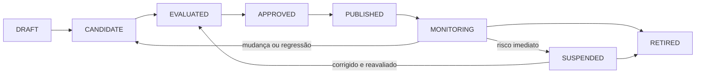
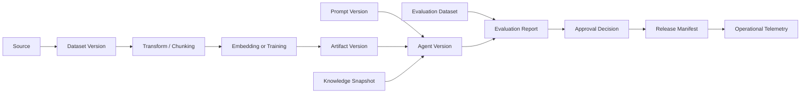

# Data, Model, Prompt and Knowledge Lifecycle

## Objet

Definition of data, datasets, models, prompts, embeddings and knowledge snapshots are recorded, evaluated, promoted, monitored, modified and removed with a cross-reference ratio.

The lifecycle exists to prevent a version of the agent being published without knowing **what actives were used, who approved them, how they were evaluated and how they can be reversed or eliminated**.

## Escopo governado

| Activity type | Exemplos | Minimum identity |
|---|---|---|
| Data source | bucket, bank, API, documentary repository | `sourceId`, owner, finality, classification, region |
| Dataset | training, evaluation, team, gold dataset | `datasetId`, version, hash, period, lineage |
| Model | foundation model, fine-tune, embedding, reranker | `modelId`, provider, fetish version, region, status |
| Prompt | system prompt, template, few-shot examples | `promptId`, version, hash, owner, compatibility |
| Knowledge snapshot | documents, chunks, index and ACLs | `knowledgeBaseId`, snapshot, embedding version, checksum |
| Policy | Authorisation, guardrail, routing, budget | `policyId`, version, decision and environment |
| Tool contract | MCP tool, OpenAPI or comando assyncron | name, version, risk, scope and schema |

## Central principle

A published agent version should be submitted to a **mutable and reproducible mix of assets:

```text
agentVersion
  ├─ code/build
  ├─ promptVersion
  ├─ modelPolicyVersion
  ├─ modelVersion or provider alias resolved
  ├─ toolContractVersions
  ├─ policyVersions
  ├─ knowledgeSnapshot
  ├─ embeddingVersion
  ├─ evaluationDatasetVersion
  └─ approvalDecision
```

Operational items may be used for coding, but the efetivly executed version must be recorded in trace, events and reports.

## Canopies



| Estado | Significado |
|---|---|
| `DRAFT` | a building asset, not yet eligible for formal assessment |
| `CANDIDATE` | frosted version for evaluation |
| `EVALUATED` | results and limitations known |
| `APPROVED` | Authorised for the esthetic, environment and defined time |
| `PUBLISHED` | available for controlled consumption |
| `MONITORING` | version in operation with active methods and gyps |
| `SUSPENDED` | bloated temporarily for risk, incident or return |
| `RETIRED` | a version of the use, with re-used access and re-retention |

The approval belongs to the version. Material change generates new version and new assessment proportional to the impact.

## Identidade e versionamento

All government assets shall register:

```yaml
assetType: PROMPT
assetId: policy-assistant-system
version: 2.3.0
contentHash: sha256:...
owner: credit-ai-team
status: APPROVED
createdAt: 2026-07-22T10:00:00Z
approvedAt: 2026-07-23T15:00:00Z
approvedFor:
  environments: [staging, production]
  riskLevels: [LOW, MEDIUM]
compatibility:
  agentVersions: [1.4.x]
  modelCapabilities: [TEXT_GENERATION, TOOL_CALLING]
lineage:
  derivedFrom: policy-assistant-system@2.2.1
changeTicket: AI-1842
```

### Regras

- published versions are imutable;
- hashes identified the efetish content, not just the legal name;
- symbiotic changes use a new version;
- a selected rollback version known, without editing production;
- aliases must be resolved for a version and register the resolution;
- non-approved assets may not be referred to in published versions.

## Lineage point to point

The line must answer:

- where did the data come from?
- - What transformations have been executed?
- - What version of the model or embedding was used?
- quais prompts e policies participaram?
- - What dataset has the version evaluated?
- - What release used the active?
- - What use, processes or decisions have been affected?



## Data and dataset lifecycle

### Offshore

Before the audition, register:

- owner and origin system;
- finalidade permitida;
- classification and data categories;
- legal basis and contractual restrictions when applicable;
- residence and international transfer;
- quality of the source and SLA;
- retention, exclusion and rights of the owner;
- a re-removal mechanism.

### Preparation and transformation

Transformations must be reproduced and adapted:

- extradition, parsing and OCR;
- clean and normalisation;
- deduction;
- masking or anonimation;
- classification and propagation of ACL;
- chunking;
- rotulagem;
- generating synthetic examples;
- split of training, validation and test.

Synthetic data do not eliminate the need to assess privacy, representation and origin.

### Data quality

| Dimensive | Control examples |
|---|---|
| Completude | compulsory fields and coverage of cereals |
| Validade | schemas, formatos e ranges |
| Representatividade | segmentos, idiomas, canais e edge cases |
| Atualidade | period, frequency and time of rot |
| Consistency | duplicidades, conflitos e labels divergentes |
| Privacidade | minimisation, masking and separation |
| Security | origem aprovada, malware e poisoning |
| Leakage | separation between training, evaluation and production |

### Change and exclude

A change in source, finality, schema, period, or policy may invalidate derivative datasets. The excluding must reach copies, chunks, embeddings, caches and derivatives when required by policy.

## Model Lifecycle

### Descoberta e cadastro

A candidate type must register:

- provider, family, version and region;
- capacities and limitations;
- data policy and retention of the supplier;
- context window e formatos suportados;
- tool calling compatibility;
- custo e limites;
- status of support and deprecation plan;
- independent and internal evaluations available.

### Assessment

Avaliar separadamente:

- quality for task;
- security and resistance to attacks;
- privacidade e data handling;
- latability and availability;
- cost for final task;
- compatibility with prompts, tools and formats;
- behaviour by language, segment and critical scene.

### Appropriation and publication

Approval shall limit:

- cases of use and risk classification;
- environment and regions;
- types of data allowed;
- capacidades autorizadas;
- limits of tokens, costs and competition;
- fallback permitido;
- Time and re-evaluations.

The Model Gateway applies to policy. Runtimes do not choose freely models outside the approved framework.

### Monitoring and deprecation

Quality monitoring, safety, reliability, cost, fallback, provider's aliases and decommissioning. Silent change of supplier's name should be detected by the efetish version registered.

## Time cycle

Prompts are software and policy tools, not informal text.

### Government content

- system instructions;
- templates and variables;
- few-shot examples;
- non-confidential content delimitators;
- tools instruction;
- messages of fallback and rejection;
- citation rules and transparency.

### Material changes

Exit a new version and evaluation:

- amendment of the object or behaviour;
- change in autonomous limits;
- inclusion of new tool or source;
- remuneration for safety instruction;
- change in the way of exit;
- relevant amendment of examples;
- adaptation for new model or language.

### Minimum tests

- golden cases;
- conflicting instructions;
- prompt injection direta e indireta;
- unused data or samples;
- tools-in-depth arguments;
- output schema;
- relapse of cost and tokens;
- Comparison with the previous version.

## Lifecycle of embeddings and knowledge snapshots

Embeddings must register model, version, size, normalisation, chunking and generation date. Standard embedding model usually requires new snapshot and reindexation.

A snapshot of knowledge must be mutable and contains:

- documentos e checksums;
- chunk versions;
- ACL, classification, finality and retention;
- embedding version;
- index or publication index;
- retrieval methods;
- documents excluded or in quarantine.

- The promotion of snapshot using equivalentalias or mechanism.

## Evaluation datasets e baselines

Assessment data are separated from training data and examples used in the prompt.

Each dataset must be:

- owner and domain;
- version and hash;
- origin and period;
- inclusion criteria;
- labels, rubricas e reviewers;
- risk and edge cover;
- validation and date of review;
- Access restrictions and retention restrictions.

Possible bases:

- previous version;
- human procedure currently;
- deterministic workflow;
- more simple or a bitch;
- Minimum threshold approved.

## Promotion gates

| Gate | Pergunta | Evidence |
|---|---|---|
| G0 — Register | Does the active have identity and ownership? | registre, finality and classification |
| G1 — Prepare | Lineage and transformations are reproduzier? | manifests, code and hashes |
| G2 — Evaluate | quality, safety, cost and performance were meds? | evaluation report e testes negativos |
| G3 — Approve | risco residual e escopo foram aceitos? | Decision, conditions and validity |
| G4 — Publish | version and dependencies are mutable and reverse? | release manifest, assinatura e rollback |
| G5 — Operate | - How are the methods, alerts and budgets active? | dashboards, SLOs e quotas |
| G6 — Reassess / Retire | change, drift or expiration have been treated? | novo bundle ou retirement record |

## Drift and re-evaluation shit

| Tipo | Sinal | Action type |
|---|---|---|
| Data drift | distribution or schema changed | blocking ingest, recalibrating dataset |
| Concept drift | relation between entry and result changed | Review rule, prompt or model |
| Model drift | quality or safety has been degraded | re-transfer, fallback or suspend |
| Prompt drift | accumulated changes have altered behaviour | consolidate version and execute return |
| Retrieval drift | recall, relevance or worse citations | reindexar, ajustar chunking ou reranker |
| Cost drift | cost per tarefa exceed baseline | Reduce context, write model or block |
| Outcome drift | Technical methodology is good, but value fell. | re-examine, process or discontinue |
| Regulatory drift | obligation or finality has changed | reclassificar risco e repetir assurance |

### Gatilhos materiais

- model change or provider;
- amendment of the main prompt;
- new source of data, tool or finality;
- change of embedding, chunking or reranking;
- incident of security or privacy;
- return above threshold;
- expiry of approval;
- regulatory or contractual change;
- relevant growth of volume, users or autonomy.

## Reverse the return

The answer should be proportional to the impact:

1. alert and open investigation;
2. reduce traffic or population;
3. deactivating tool or specific capacity;
4. to write to model or previous snapshot;
5. exigir human-in-the-loop;
6. suspend the version;
7. retirar e revogar acessos.

## Retraining, fine-tuning e re-embedding

Retraining or fine tuning must not be automatic only because drift was detected. First identify cause, risk, necessary data and more simple alternative.

When done:

- containing the dataset and training code;
- registrating parasols, seed and environment;
- gerar novo model artifact e model card;
- repeating the full assessment applicable;
- compare baseline and previous version;
- usar rollout controlado;
- Maintain independent rollback from the training pipeline.

Re-embedding is the equivalent procedure for snapshot knowledge, with retrieval validation and authorisation before promotion.

## Evidence bundle

```text
asset-manifest.yaml
data-contracts/
lineage.json
source-snapshots/
transformation-manifest.json
model-card.md
model-policy.yaml
prompt-manifest.json
knowledge-snapshot.json
dataset-manifest.json
evaluation-report.json
security-tests.json
approval-decision.json
release-manifest.json
operational-baseline.json
change-record.json
retirement-record.json
```

## Responsabilidades

| Papel | Responsabilidade |
|---|---|
| Business Owner | finality, outcome and acceptance of residual risk |
| Data Owner | sources, quality, access, retention and excluding |
| AI Architect | Borders, compatibility and architectural decisions |
| Model Risk / Evaluation | methodology, datasets, thresholds and independence |
| Security / Privacy | threats, data, suppliers and controls |
| Platform Team | registry, manifests, policies and technical promotion |
| Product Team | prompts, experience, feedback and results methods |
| Operations / SRE | SLOs, monitoramento, incidentes, rollback e retirada |

## Integration with government

- [Enterprise AI Governance Framework](ai-governance-framework.md)
- [Government Crosswalk, Risco and Compliance](compliance-crosswalk.md)
- [AI Risk Framework](ai-risk-framework.md)
- [Evaluation Framework](evaluation-framework.md)
- (ADR-007 — Hybrid and contingency assessment)(../adrs/007-evaluation-strategy.md)

## Anti-patterns

- using `latest` without registering efetiva version;
- edit prompt directly in production;
- mix training and evaluation data;
- tamping without updating the index;
- adopt model without limiting quality, region or data;
- monitor only availability and consistency;
- maintaining access to assets by anti-credit credentials;
- adjust the model without investigating data, prompt, retrieval and process.
