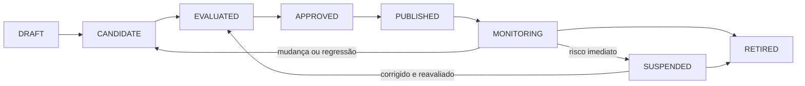
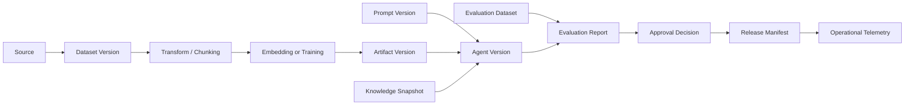

# Data, Model, Prompt and Knowledge Lifecycle

## Objetivo

Definir como dados, datasets, modelos, prompts, embeddings e snapshots de conhecimento são registrados, avaliados, promovidos, monitorados, alterados e retirados com rastreabilidade ponta a ponta.

O lifecycle existe para impedir que uma versão de agente seja publicada sem saber **quais ativos foram usados, quem os aprovou, como foram avaliados e como podem ser revertidos ou eliminados**.

## Escopo governado

| Tipo de ativo | Exemplos | Identidade mínima |
|---|---|---|
| Fonte de dados | bucket, banco, API, repositório documental | `sourceId`, owner, finalidade, classificação, região |
| Dataset | treino, avaliação, red-team, golden dataset | `datasetId`, versão, hash, período, lineage |
| Modelo | foundation model, fine-tune, embedding, reranker | `modelId`, provider, versão efetiva, região, status |
| Prompt | system prompt, template, few-shot examples | `promptId`, versão, hash, owner, compatibilidade |
| Knowledge snapshot | documentos, chunks, índice e ACLs | `knowledgeBaseId`, snapshot, embedding version, checksum |
| Policy | autorização, guardrail, routing, budget | `policyId`, versão, decisão e ambiente |
| Tool contract | MCP tool, OpenAPI ou comando assíncrono | nome, versão, risco, scopes e schema |

## Princípio central

Uma versão publicada de agente deve apontar para um conjunto **imutável e reproduzível** de ativos:

```text
agentVersion
  ├─ code/build
  ├─ promptVersion
  ├─ modelPolicyVersion
  ├─ modelVersion or provider alias resolved
  ├─ toolContractVersions
  ├─ policyVersions
  ├─ knowledgeSnapshot
  ├─ embeddingVersion
  ├─ evaluationDatasetVersion
  └─ approvalDecision
```

Aliases operacionais podem ser usados para roteamento, mas a versão efetivamente executada deve ser registrada em traces, eventos e relatórios.

## Estados canônicos



| Estado | Significado |
|---|---|
| `DRAFT` | ativo em construção, ainda não elegível para avaliação formal |
| `CANDIDATE` | versão congelada para avaliação |
| `EVALUATED` | resultados e limitações conhecidos |
| `APPROVED` | autorizado para escopo, ambiente e prazo definidos |
| `PUBLISHED` | disponível para consumo controlado |
| `MONITORING` | versão em operação com métricas e gatilhos ativos |
| `SUSPENDED` | uso bloqueado temporariamente por risco, incidente ou regressão |
| `RETIRED` | versão fora de uso, com acessos revogados e retenção tratada |

A aprovação pertence à versão. Alteração material gera nova versão e nova avaliação proporcional ao impacto.

## Identidade e versionamento

Todo ativo governado deve registrar:

```yaml
assetType: PROMPT
assetId: policy-assistant-system
version: 2.3.0
contentHash: sha256:...
owner: credit-ai-team
status: APPROVED
createdAt: 2026-07-22T10:00:00Z
approvedAt: 2026-07-23T15:00:00Z
approvedFor:
  environments: [staging, production]
  riskLevels: [LOW, MEDIUM]
compatibility:
  agentVersions: [1.4.x]
  modelCapabilities: [TEXT_GENERATION, TOOL_CALLING]
lineage:
  derivedFrom: policy-assistant-system@2.2.1
changeTicket: AI-1842
```

### Regras

- versões publicadas são imutáveis;
- hashes identificam o conteúdo efetivo, não apenas o nome lógico;
- mudanças semânticas usam nova versão;
- rollback seleciona versão conhecida, sem editar produção;
- aliases devem resolver para uma versão e registrar a resolução;
- ativos não aprovados não podem ser referenciados por versões publicadas.

## Lineage ponta a ponta

O lineage deve responder:

- de onde vieram os dados?
- quais transformações foram executadas?
- qual versão do modelo ou embedding foi usada?
- quais prompts e policies participaram?
- qual dataset avaliou a versão?
- qual release consumiu o ativo?
- quais usuários, processos ou decisões foram impactados?



## Lifecycle de dados e datasets

### Onboarding de fonte

Antes da ingestão, registrar:

- owner e sistema de origem;
- finalidade permitida;
- classificação e categorias de dados;
- base legal e restrições contratuais quando aplicável;
- residência e transferência internacional;
- qualidade esperada e SLA da fonte;
- retenção, exclusão e direitos do titular;
- mecanismo de revogação.

### Preparação e transformação

Transformações precisam ser reproduzíveis e versionadas:

- extração, parsing e OCR;
- limpeza e normalização;
- deduplicação;
- masking ou anonimização;
- classificação e propagação de ACL;
- chunking;
- rotulagem;
- geração de exemplos sintéticos;
- split de treino, validação e teste.

Dados sintéticos não eliminam a necessidade de avaliar privacidade, representatividade e proveniência.

### Qualidade de dataset

| Dimensão | Exemplos de controle |
|---|---|
| Completude | campos obrigatórios e cobertura de cenários |
| Validade | schemas, formatos e ranges |
| Representatividade | segmentos, idiomas, canais e edge cases |
| Atualidade | período, frequência e data de corte |
| Consistência | duplicidades, conflitos e labels divergentes |
| Privacidade | minimização, masking e segregação |
| Segurança | origem aprovada, malware e poisoning |
| Leakage | separação entre treino, avaliação e produção |

### Mudança e exclusão

Uma mudança de fonte, finalidade, schema, período ou política pode invalidar datasets derivados. A exclusão deve alcançar cópias, chunks, embeddings, caches e derivados quando exigido pela política.

## Lifecycle de modelos

### Descoberta e cadastro

Um modelo candidato deve registrar:

- provider, família, versão e região;
- capacidades e limitações;
- política de dados e retenção do fornecedor;
- context window e formatos suportados;
- compatibilidade de tool calling;
- custo e limites;
- status de suporte e plano de depreciação;
- avaliações independentes e internas disponíveis.

### Avaliação

Avaliar separadamente:

- qualidade por tarefa;
- segurança e resistência a ataques;
- privacidade e data handling;
- latência e disponibilidade;
- custo por tarefa concluída;
- compatibilidade com prompts, tools e formatos;
- comportamento por idioma, segmento e cenário crítico.

### Aprovação e publicação

A aprovação deve limitar:

- casos de uso e classificação de risco;
- ambientes e regiões;
- tipos de dados permitidos;
- capacidades autorizadas;
- limites de tokens, custo e concorrência;
- fallback permitido;
- prazo e gatilhos de reavaliação.

O Model Gateway aplica a política. Runtimes não escolhem livremente modelos fora do conjunto aprovado.

### Monitoramento e depreciação

Monitorar qualidade, segurança, latência, custo, fallback, alterações do provider e descontinuação. Mudança silenciosa de alias do fornecedor deve ser detectada pela versão efetiva registrada.

## Lifecycle de prompts

Prompts são artefatos de software e política, não texto informal.

### Conteúdo governado

- system instructions;
- templates e variáveis;
- few-shot examples;
- delimitadores de conteúdo não confiável;
- instruções de tool use;
- mensagens de fallback e recusa;
- regras de citação e transparência.

### Mudanças materiais

Exigem nova versão e avaliação:

- alteração de objetivo ou comportamento;
- mudança em limites de autonomia;
- inclusão de nova tool ou fonte;
- remoção de instrução de segurança;
- mudança de formato de saída;
- alteração relevante de exemplos;
- adaptação para novo modelo ou idioma.

### Testes mínimos

- golden cases;
- instruções conflitantes;
- prompt injection direta e indireta;
- dados ausentes ou ambíguos;
- argumentos inválidos de tool;
- output schema;
- regressão de custo e tokens;
- comparação com versão anterior.

## Lifecycle de embeddings e knowledge snapshots

Embeddings devem registrar modelo, versão, dimensão, normalização, chunking e data de geração. Troca de modelo de embedding normalmente exige novo snapshot e reindexação.

Um knowledge snapshot deve ser imutável e conter:

- documentos e checksums;
- versões de chunks;
- ACL, classificação, finalidade e retenção;
- embedding version;
- índice ou alias de publicação;
- métricas de retrieval;
- documentos excluídos ou em quarentena.

Promoção de snapshot usa alias ou mecanismo equivalente. Rollback retorna para snapshot conhecido sem reconstrução emergencial.

## Evaluation datasets e baselines

Datasets de avaliação são separados de dados de treino e de exemplos usados no prompt.

Cada dataset deve possuir:

- owner e domínio;
- versão e hash;
- origem e período;
- critérios de inclusão;
- labels, rubricas e reviewers;
- cobertura de riscos e edge cases;
- validade e data de revisão;
- restrições de acesso e retenção.

Baselines possíveis:

- versão anterior;
- processo humano atual;
- workflow determinístico;
- modelo mais simples ou barato;
- threshold mínimo aprovado.

## Gates de promoção

| Gate | Pergunta | Evidências |
|---|---|---|
| G0 — Register | o ativo possui identidade e owner? | registro, finalidade e classificação |
| G1 — Prepare | lineage e transformações são reproduzíveis? | manifests, código e hashes |
| G2 — Evaluate | qualidade, segurança, custo e performance foram medidos? | evaluation report e testes negativos |
| G3 — Approve | risco residual e escopo foram aceitos? | decisão, condições e validade |
| G4 — Publish | versão e dependências são imutáveis e reversíveis? | release manifest, assinatura e rollback |
| G5 — Operate | métricas, alertas e budgets estão ativos? | dashboards, SLOs e quotas |
| G6 — Reassess / Retire | mudança, drift ou expiração foram tratados? | novo bundle ou retirement record |

## Drift e gatilhos de reavaliação

| Tipo | Sinal | Exemplo de ação |
|---|---|---|
| Data drift | distribuição ou schema mudou | bloquear ingestão, recalibrar dataset |
| Concept drift | relação entre entrada e resultado mudou | revisar regra, prompt ou modelo |
| Model drift | qualidade ou segurança degradou | trocar versão, fallback ou suspender |
| Prompt drift | mudanças acumuladas alteraram comportamento | consolidar versão e executar regressão |
| Retrieval drift | recall, relevância ou citações pioraram | reindexar, ajustar chunking ou reranker |
| Cost drift | custo por tarefa excedeu baseline | reduzir contexto, rotear modelo ou bloquear |
| Outcome drift | métrica técnica está boa, mas valor caiu | revisar produto, processo ou descontinuar |
| Regulatory drift | obrigação ou finalidade mudou | reclassificar risco e repetir assurance |

### Gatilhos materiais

- mudança de modelo ou provider;
- alteração do prompt principal;
- nova fonte de dados, tool ou finalidade;
- mudança de embedding, chunking ou reranker;
- incidente de segurança ou privacidade;
- regressão acima do threshold;
- expiração da aprovação;
- mudança regulatória ou contratual;
- crescimento relevante de volume, usuários ou autonomia.

## Respostas a regressão

A resposta deve ser proporcional ao impacto:

1. alertar e abrir investigação;
2. reduzir tráfego ou população;
3. desabilitar tool ou capacidade específica;
4. rotear para modelo ou snapshot anterior;
5. exigir human-in-the-loop;
6. suspender a versão;
7. retirar e revogar acessos.

## Retraining, fine-tuning e re-embedding

Retraining ou fine-tuning não deve ser automático apenas porque drift foi detectado. Primeiro identificar causa, risco, dados necessários e alternativa mais simples.

Quando realizado:

- congelar dataset e código de treino;
- registrar parâmetros, seed e ambiente;
- gerar novo model artifact e model card;
- repetir avaliação completa aplicável;
- comparar com baseline e versão anterior;
- usar rollout controlado;
- manter rollback independente do pipeline de treino.

Re-embedding segue processo equivalente para knowledge snapshots, com validação de retrieval e autorização antes da promoção.

## Evidence bundle

```text
asset-manifest.yaml
data-contracts/
lineage.json
source-snapshots/
transformation-manifest.json
model-card.md
model-policy.yaml
prompt-manifest.json
knowledge-snapshot.json
dataset-manifest.json
evaluation-report.json
security-tests.json
approval-decision.json
release-manifest.json
operational-baseline.json
change-record.json
retirement-record.json
```

## Responsabilidades

| Papel | Responsabilidade |
|---|---|
| Business Owner | finalidade, outcome e aceite do risco residual |
| Data Owner | fontes, qualidade, acesso, retenção e exclusão |
| AI Architect | fronteiras, compatibilidade e decisões arquiteturais |
| Model Risk / Evaluation | metodologia, datasets, thresholds e independência |
| Security / Privacy | ameaças, dados, fornecedores e controles |
| Platform Team | registry, manifests, policies e promoção técnica |
| Product Team | prompts, experiência, feedback e métricas de resultado |
| Operations / SRE | SLOs, monitoramento, incidentes, rollback e retirada |

## Integração com governança

- [Enterprise AI Governance Framework](ai-governance-framework.md)
- [Crosswalk de Governança, Risco e Compliance](compliance-crosswalk.md)
- [AI Risk Framework](ai-risk-framework.md)
- [Evaluation Framework](evaluation-framework.md)
- [ADR-007 — Avaliação híbrida e contínua](../adrs/007-evaluation-strategy.md)

## Anti-patterns

- usar `latest` sem registrar versão efetiva;
- editar prompt diretamente em produção;
- misturar dados de treino e avaliação;
- trocar embedding sem versionar o índice;
- aprovar modelo sem limitar finalidade, região ou dados;
- monitorar somente disponibilidade e latência;
- manter ativos aposentados acessíveis por credenciais antigas;
- atribuir drift ao modelo sem investigar dados, prompt, retrieval e processo.
