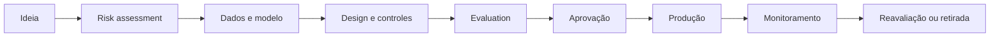

# Responsible AI

## Objective

Defining principles, decisions, controls and evidence to ensure that AI solutions are fair, transparent, secure, reliable and supervised throughout the lifecycle.

## Principles

| This is a principle. | Question on architecture | Expected evidence |
|---|---|---|
| Fairness | Does the system produce disproportionate impact between groups? | Metrics by segment, test dataset and mitigation plan |
| Transparency | Does the user know that they're interacting with AI, and what are their limits? | Notice of use, Agent Card and published limitations |
| Explicabilidade | Is it possible to justify answers or decisions? | The Commission considers that the Commission should take into account the fact that, in the light of the above, it is not possible to determine whether the aid is compatible with the internal market. |
| Accountability | Is there someone responsible for risk, operation and outcome? | owner, approvers, RACI and decision record |
| Privacidade | Does the use of data respect purpose, minimisation and retention? | Classification, legal basis, DPIA/LIA where applicable and TTL |
| Security | Are inputs, context, memory, tools and exits treated as unreliable? | threat model, adverse testing and technical controls |
| Robustez | Does the system degrade safely in the face of failures or changes? | The manufacturer shall ensure that the following conditions are met: |
| Human supervision | Is the autonomy proportional to the impact? | human-in-the-loop, transaction limits and function segregation |

## Life cycle

## Requirements by stage

### Discovery and design

- define purpose, users, impact and limits of use;
- classify risk and data;
- identificar grupos potencialmente afetados;
- determine the maximum degree of autonomy;
- registering alternatives that are not based on AI.

### Construction

- use approved and traceable sources;
- to publish prompts, templates, policies and datasets;
- separate reliable instructions from unreliable content;
- apply minimisation, masking and access controls;
- implement explanations proportionate to the use case.

### Assessment

- measuring quality, groundedness, safety, bias and robustness;
- perform adverse and relevant segmental testing;
- compare against baseline and previous version;
- require human review for HIGH and CRITICAL risks.

### Operations

- monitoring drift, regression, toxicity, incidents and cost;
- record decisions and tool calls without exposing sensitive content;
- maintain a challenge channel and human scale;
- re-evaluate after a change in model, prompt, source or purpose.

## Fairness and prejudice

Fairness should only be assessed with attributes and segments that are legitimate for the context.

Minimum controls:

1. define groups and metrics before the test;
2. analyze disparities in accuracy, false positives and false negatives;
3. review the representativeness and quality of data;
4. document trade-offs between performance and equity;
5. block publication when the residual impact is not accepted.

## Transparency for the user

Each experience shall inform:

- that there is AI involved;
- which data are used;
- which actions the system can perform;
- known limitations;
- how to request human review;
- How to challenge or correct a decision.

## Human-in-the-loop

| Impacto | Standard of supervision |
|---|---|
| Informativo | sampling review |
| Recommendation | humano decide |
| Reversible writing | explicit confirmation |
| Critical writing | dual approval or function segregation |
| Regulated decision | final human decision or specific legal control |

## Compulsory evidence

- Agent Card ou Model Card;
- risk assessment;
- data set and assessment report;
- the authorisation matrix;
- justification of the level of autonomy;
- the recording of limitations and residual risks;
- monitoring plan, rollback and withdrawal.
