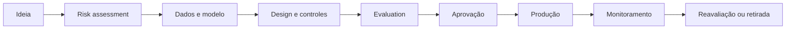

# Responsible AI

## Objet

Define principles, decisions, controls and evidence to ensure that the solutions of AI are fair, transparent, safe, confidential and monitored throughout the whole life cycle.

## Principles

| Principle | Question of architecture | Evidence sprained |
|---|---|---|
| Fairness | Does the system make a difference between groups? | segments, test dataset and mitigation plan |
| Transparency | The user knows that he interferes with the AI and what are his limits? | a user's notice, Agent Card and restricted versions |
| Explicabilidade | Is it possible to justify answers or decisions? | citations, relevant factors, allowed rationale and decision-making trility |
| Accountability | Is there a risk-free risk-free operator, and result-free? | owner, producers, RACI and decision-making register |
| Privacidade | The use of data respects finality, minimisation and retention? | classification, legal basis, DPIA/LIA when applicable and TTL |
| Security | Entry, context, memory, rails and exits are treated as untrustworthy? | threat model, adversarial tests and technical controls |
| Robustez | The unsafe system before mistakes or changes? | fallback, circuitbreaker, resilience tests and rollback |
| Human supervision | Is autonomy proportionate to impact? | human-in-the-loop, transnational limits and function separation |

## Life cycle

## Level requirements

### Descoberta e design

- define finality, users, impact and use limits;
- classifying risk and data;
- identificar grupos potencialmente afetados;
- deciding the maximum degree of autonomy;
- registrating alternative not based on IA.

### Construction

- using approved and rastreaded sources;
- to update prompts, models, policies and datasets;
- separate confidential content instructions not confidential;
- implementing minimisation, mascara and access controls;
- implement appropriate explanations for use.

### Assessment

- reducing quality, stability, safety, viability and strength;
- to perform adversarial tests and relevant segments;
- compare baseline and previous version;
- requiring human review for high and chronic risks.

### Operation

- monitor drift, regress, toxicity, incidents and cost;
- to register decisions and tools calls without expenditure of any sensible content;
- maintain a channel of human contestation and escalonation;
- revaluating after model change, prompt, source or finish.

## Fairness and you saw

Fairness must be assessed only with fair attributes and segments for the context. Remuneration of a sensible attribute does not necessarily eliminate the viables, becauseproxies may remain.

Minimum controls:

1. define groups and methods before the test;
2. examining the disparity of precision, positive and negative negative;
3. review the representation and quality of data;
4. documentar trade-offs entre performance e equidade;
5. block publication when residual impact is not accepted.

## Transparency for the user

All experience must inform:

- that there is AI involved;
- which data are used;
- which actions the system can execute;
- known limits;
- as to request human review;
- as to contest or rectify a decision.

## Human-in-the-loop

| Impacto | Supervisory rule |
|---|---|
| Informativo | Revision by sampling |
| Recommendation | humano decide |
| Reverse writing | explcital confirmation |
| Critical writing | double approval or separation of function |
| Regulation Decision | Final human decision or specific legal control |

## Obligatory evidence

- Agent Card ou Model Card;
- risk assessment;
- dataset and assessment report;
- the authorisations mater;
- a justified level of autonomy;
- registre of restricted and residual risks;
- Monitoring, rollback and withdrawal plan.
