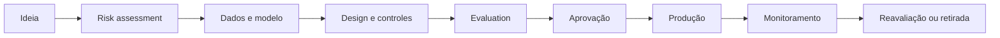

# Responsible AI

## Objetivo

Definir princípios, decisões, controles e evidências para que soluções de IA sejam justas, transparentes, seguras, confiáveis e supervisionáveis ao longo de todo o ciclo de vida.

## Princípios

| Princípio | Pergunta de arquitetura | Evidência esperada |
|---|---|---|
| Fairness | O sistema produz impacto desproporcional entre grupos? | métricas por segmento, dataset de teste e plano de mitigação |
| Transparência | O usuário sabe que interage com IA e quais são seus limites? | aviso de uso, Agent Card e limitações publicadas |
| Explicabilidade | É possível justificar respostas ou decisões? | citações, fatores relevantes, rationale permitido e trilha de decisão |
| Accountability | Existe um responsável por risco, operação e resultado? | owner, aprovadores, RACI e registro de decisão |
| Privacidade | O uso de dados respeita finalidade, minimização e retenção? | classificação, base legal, DPIA/LIA quando aplicável e TTL |
| Segurança | Entradas, contexto, memória, ferramentas e saídas são tratados como não confiáveis? | threat model, testes adversariais e controles técnicos |
| Robustez | O sistema degrada de forma segura diante de falhas ou mudanças? | fallback, circuit breaker, testes de resiliência e rollback |
| Supervisão humana | A autonomia é proporcional ao impacto? | human-in-the-loop, limites transacionais e segregação de função |

## Ciclo de vida

## Requisitos por etapa

### Descoberta e design

- definir finalidade, usuários, impacto e limites de uso;
- classificar risco e dados;
- identificar grupos potencialmente afetados;
- decidir o grau máximo de autonomia;
- registrar alternativas não baseadas em IA.

### Construção

- usar fontes aprovadas e rastreáveis;
- versionar prompts, modelos, políticas e datasets;
- separar instruções confiáveis de conteúdo não confiável;
- aplicar minimização, mascaramento e controles de acesso;
- implementar explicações proporcionais ao caso de uso.

### Avaliação

- medir qualidade, groundedness, segurança, viés e robustez;
- executar testes adversariais e por segmentos relevantes;
- comparar contra baseline e versão anterior;
- exigir revisão humana para riscos HIGH e CRITICAL.

### Operação

- monitorar drift, regressão, toxicidade, incidentes e custo;
- registrar decisões e tool calls sem expor conteúdo sensível;
- manter canal de contestação e escalonamento humano;
- reavaliar após mudança de modelo, prompt, fonte ou finalidade.

## Fairness e viés

Fairness deve ser avaliada somente com atributos e segmentos legítimos para o contexto. A remoção de um atributo sensível não elimina necessariamente o viés, pois proxies podem permanecer.

Controles mínimos:

1. definir grupos e métricas antes do teste;
2. analisar disparidade de precisão, falsos positivos e falsos negativos;
3. revisar representatividade e qualidade dos dados;
4. documentar trade-offs entre performance e equidade;
5. bloquear publicação quando o impacto residual não for aceito.

## Transparência para o usuário

Toda experiência deve informar:

- que há IA envolvida;
- quais dados são usados;
- quais ações o sistema pode executar;
- limitações conhecidas;
- como solicitar revisão humana;
- como contestar ou corrigir uma decisão.

## Human-in-the-loop

| Impacto | Padrão de supervisão |
|---|---|
| Informativo | revisão por amostragem |
| Recomendação | humano decide |
| Escrita reversível | confirmação explícita |
| Escrita crítica | dupla aprovação ou segregação de função |
| Decisão regulada | decisão humana final ou controle legal específico |

## Evidências obrigatórias

- Agent Card ou Model Card;
- risk assessment;
- dataset e relatório de avaliação;
- matriz de autorização;
- justificativa do nível de autonomia;
- registro de limitações e riscos residuais;
- plano de monitoramento, rollback e retirada.
