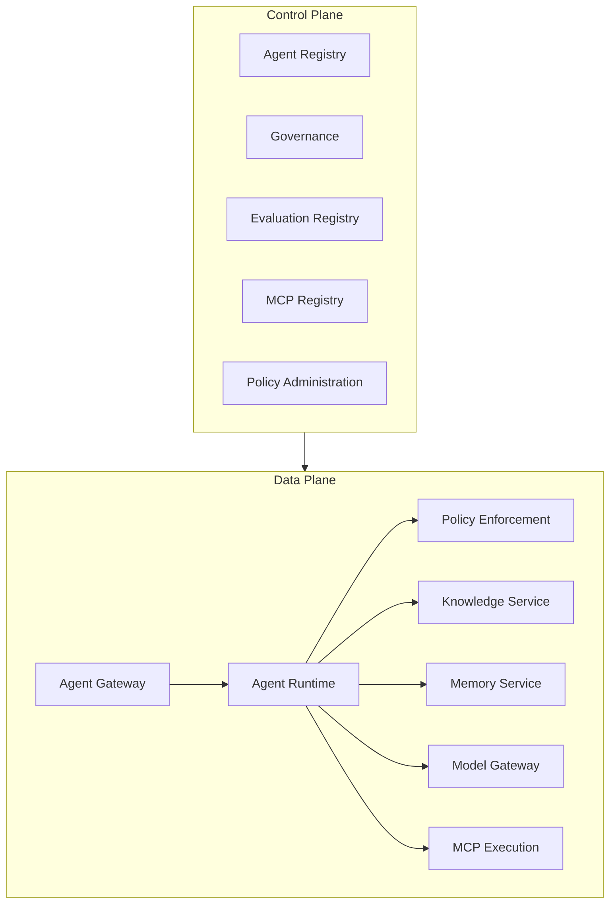

# Enterprise AI Platform Reference Book

> Architecture, tracing, logs, methods and reference book in a quick view.

This site contains a **reference book to guide the development, governance, implementation and operation of AI-based corporative plates**.

He combines editorial narrative, architectural models, contracts, policies, checklists and a small technical sample used only to validate part of the documents.

> This project does not deliver a ready platform or provide a single technological implementation. The components and services represent legal capabilities that must be adapted to the context of each organisation.

## Starts by your objective

-   :material-briefcase-outline: **External video**

    ---

    I understand that the platform is necessary and co-nects strategy, outcomes, capacities and investment.

    [Come with the outcomes](book/02-business-outcomes.md)

-   :material-sitemap-outline: **Arcadiate**

    ---

    Explore capability map, control plane, data plane, services, contracts and decisions.

    [Open the capability map](book/02-capability-map.md)

-   :material-account-group-outline: **Operating model**

    ---

    Defining papets, RACI, frogs, golden path and proportive twists to the risk.

    [Ler the operating model](book/03-operating-model.md)

-   :material-source-branch: **Delivery e lifecycle**

    ---

    Gate structure, evidence, evaluation, publication, operation and withdrawal of agents and assets of the A.

    [By breaking the active lifecycle](governance/model-lifecycle.md)

-   :material-shield-check-outline: **Security and governance**

    ---

    Using raster controls, authorisation, threat modeling, RAG security, memory, LGPD and AI Risk Framework.

    [Open the compliance crosswalk](governance/compliance-crosswalk.md)

-   :material-flask-outline: **Casos aplicados**

    ---

    Compare concrete materialisations for the IA bank-phone conversation, regulated backoffice automapping and software engineering designed by agents.

    (open the cases applicable)(case-studies/index.md)

## Cases applied in this case

| Caso | Capacidades demonstradas | Estado |
|---|---|---|
| (Multi-Skill linguistic language)(case-studies/conversational-ai.md) | Agent Runtimes, MCP, RAG, memory, journals, eventing, auditory and evaluations | executing reference and POC endured |
| (Intelligent Backoffice — bancarial contest)(case-studies/intelligent-backoffice.md) | persistent workflow, Document Intelligence, research, recommendation, human adoption, OPA, ineffective implementation and reconciliation | baseline shown; backend and frontend in implementation |
| [Agentic SDLC governado](case-studies/agentic-sdlc.md) | oito papetis of agent, hard workflow, Model Gateway, MCP, OPA, checkpoints, evidence bundles, digest, released and rollback | operation runtime and controlled integration; production delayed |

## Livro

1. [Why a AI Platform?](book/01-why-ai-platform.md)
2. [Business Outcomes](book/02-business-outcomes.md)
3. [Capability Map](book/02-capability-map.md)
4. [Operating Model](book/03-operating-model.md)
5. [Life cycle of agents](book/04-agent-lifecycle.md)
6. [Assault study: documentary agent with RAG](book/05-case-study-document-agent.md)
7. [Decision Guides](book/06-decision-guides.md)
8. [Model of maturity and roadmap](book/07-adoption-roadmap.md)
9. (production checklists)(book/08-production-checklists.md)
10. [Glossary](book/glossary.md)

## Resumptuous ash

The above is logical, and it does not determine the quantity of services, technology, product or implant topology.

## Canopies

| Assunto | Fonte |
|---|---|
| Architecture decisions | (ADR Catalogue)(adrs/index.md) |
| APIs HTTP | [OpenAPI](contracts/openapi.yaml) |
| Eventos | [AsyncAPI](contracts/async-api.yaml) |
| Governance and compliance | [Crosswalk](governance/compliance-crosswalk.md) |
| Lifecycle of IA assets | [Data, Model, Prompt and Knowledge Lifecycle](governance/model-lifecycle.md) |
| Security of RAG and memory | [Pathron](security/rag-memory-security.md) |
| Risco | [AI Risk Framework](governance/ai-risk-framework.md) |
| SLOs | (Not working requirements)(architecture/non-functional-requirements.md) |
| Reference deployment | [C4 Deployment](architecture/diagrams/c4-deployment.puml) |
| Validation sample | [Vertical slice](https://github.com/leandrosflora/enterprise-ai-platform-demo-arch/tree/main/samples/vertical-slice) |

## PDF

**Book** workflow generates a consolidated Markdown manuscript, a PDF and rendered previews. The files are available as the GitHub Actions artifact for each execution of the workflow.
