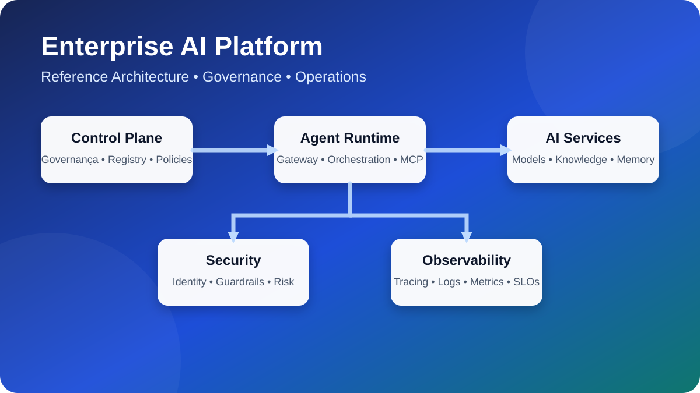
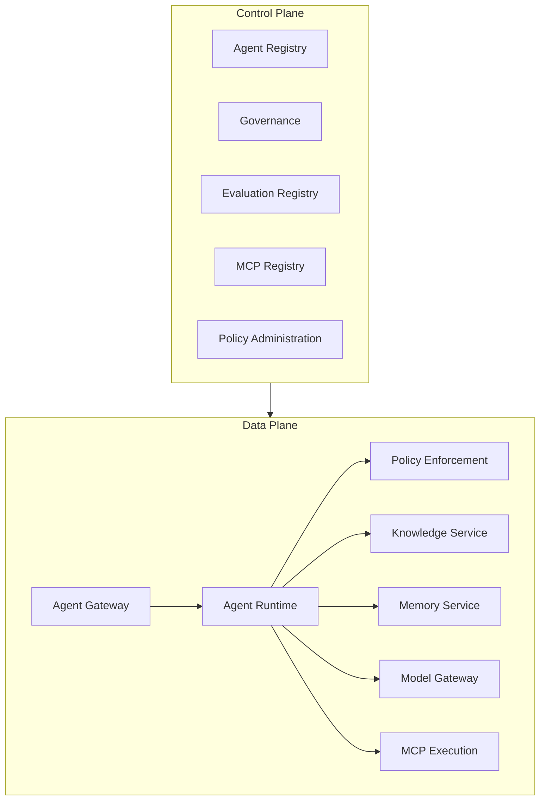

# Enterprise AI Platform Reference Book

> Architecture, tracing, logs, metrics and reference book in a quick view.

This site provides a **reference book to guide the design, governance, implementation and operation of corporate AI platforms**.

It combines editorial narrative, architectural models, contracts, policies, checklists and a small technical sample used only to validate part of the documented artifacts.

> This project does not deliver a ready platform or prescribe a single technological implementation. The components and services represent logical capacities that must be adapted to the context of each organization.

## Start with your goal

-   : Outer-briefcase material: **Executive vision**

    ---

    Understand why the platform is needed and connect strategy, outcomes, capabilities and investment.

        [Start with outcomes](book/02-business-outcomes.md)

-   :sitemap-outline material: **Architecture**

    ---

    Explore capability map, control plane, date plane, services, contracts and decisions.

        [Abrir o capability map](book/02-capability-map.md)

-   :material-account-group-outline: **Operating model**

    ---

    Define roles, ICAR, forums, golden path and risk proportional routes.

        [Ler o operating model](book/03-operating-model.md)

-   : source-branch: **Delivery and lifecycle**

    ---

    Estruture gates, evidence, evaluation, publication, operation and removal of AI agents and assets.

        [Opening the lifecycle of assets](governance/model-lifecycle.md)

-   : material-shield-check-outline: **Security and governance**

    ---

    Apply traceable controls, authorisation, threat modeling, RAG security, memory, LGPD and AI Risk Framework.

        [Opening the crosswalk de compliance](governance/compliance-crosswalk.md)

-   :flask-outline material: **Cases applied**

    ---

    Comparison of concrete materializations for AI bank conversational, regulated backoffice automation and agent-oriented software engineering.

        [Opening applicable cases](case-studies/index.md)

## Highlighted cases

| Case | Capacities demonstrated | State |
|---|---|---|
|  [Multi-skill banking conversational platform](case-studies/conversational-ai.md)  | Agent Runtimes, MCP, RAG, memory, journeys, eventing, audit and evaluation | Implementable reference and hardened COP |
|  [Intelligent Backoffice — bank contest](case-studies/intelligent-backoffice.md)  | Persistent workflow, Document Intelligence, research, recommendation, human approval, PAO, inadequate execution and reconciliation | demonstrated baseline; backend and frontend in implementation |
|  [Agentic SDLC governado](case-studies/agentic-sdlc.md)  | 8 roles of agent, durable workflow, Model Gateway, MCP, OPA, checkpoints, evidence bundles, digest approval, observed release and rollback | Functional runtime and controlled integration; outstanding production |

## Book

1. [Why an AI Platform?](book/01-why-ai-platform.md)
2. [Business Outcomes](book/02-business-outcomes.md)
3. [Capability Map](book/02-capability-map.md)
4. [Operating Model](book/03-operating-model.md)
5. [Life cycle of agents](book/04-agent-lifecycle.md)
6. [Case study: documentary agent with RAG](book/05-case-study-document-agent.md)
7. [Decision Guides](book/06-decision-guides.md)
8. [Maturity model and roadmap](book/07-adoption-roadmap.md)
9. [Production Checklists](book/08-production-checklists.md)
10. [Glossary](book/glossary.md)

## Summary architecture

The decomposition above is logical, it does not determine the amount of services, technology, product or topology of implementation.

## Canon references

| Subject | Source |
|---|---|
| Architectural decisions |  [ADR Catalogue](adrs/index.md)  |
| HTTP APIs |  [OpenAPI](contracts/openapi.yaml)  |
| Events |  [AsyncAPI](contracts/async-api.yaml)  |
| Governance and compliance |  [Crosswalk](governance/compliance-crosswalk.md)  |
| Lifecycle of AI assets |  [Date, Model, Prompt and Knowledge Lifecycle](governance/model-lifecycle.md)  |
| RAG security and memory |  [Pattern](security/rag-memory-security.md)  |
| Risk |  [AI Risk Framework](governance/ai-risk-framework.md)  |
| SLOs |  [Non-functional requirements](architecture/non-functional-requirements.md)  |
| Reference deployment |  [Deployment](architecture/diagrams/c4-deployment.puml)  |
| Validation sample |  [Vertical slice](https://github.com/leandrosflora/enterprise-ai-platform-demo-arch/tree/main/samples/vertical-slice)  |

## PDF

The workflow **Book** it generates a consolidated Markdown manuscript, a PDF and rendered previews.The files are available as artifact of the GitHub Actions at each execution of the workflow.
