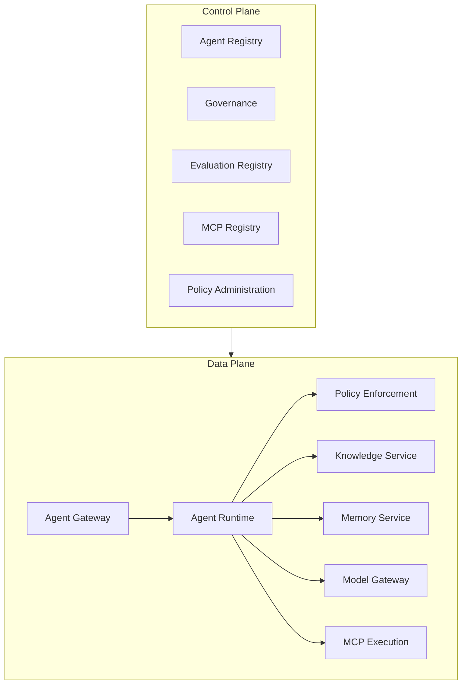

# Enterprise AI Platform Reference Book

> Architecture, tracing, logs, metrics and reference book in a quick look.

This website presents a reference book to guide the design, governance, implementation and operation of corporate AI platforms**.

It combines editorial narrative, architectural models, contracts, policies, checklists and a small technical sample used only to validate part of the documented artifacts.

> This project does not deliver a ready platform or prescribe a single technological implementation.

## Start with your goal

-   This is the first of a series of reports on the implementation of this Regulation.

    ---

    Understand why the platform is needed and connect strategy, outcomes, capabilities and investment.

    [Start with the outcome](book/02-business-outcomes.md)

-   This is a list of the countries of the European Economic Area.

    ---

    Explore capability map, control plane, data plane, services, contracts and decisions.

    [Open the capability map](book/02-capability-map.md)

-   :material-account-group-outline: **Operating model**

    ---

    It defines roles, RACI, forums, golden paths and risk-proportionate routes.

    [Read the operating model]book/03-operating-model.md)

-   :material-source-branch: **Delivery and lifecycle**

    ---

    Structure gates, evidence, evaluation, publication, operation and withdrawal of AI agents and assets.

    [Opening the lifecycle of assets](governance/model-lifecycle.md)

-   :material-shield-check-outline: **Security and governance**

    ---

    It applies traceable controls, authorization, threat modeling, security of RAG, memory, LGPD and AI Risk Framework.

    [Open the compliance crosswalk](governance/compliance-crosswalk.md)

-   :material-flask-outline: **Applied cases**

    ---

    Compare concrete materializations for banking conversational AI, regulated back office automation and agent-driven software engineering.

    [Open the case](case-studies/index.md)

## Cases reported

| Case in point | Demonstrated capabilities | State of origin |
|---|---|---|
| [Multi-skill banking conversation platform]case-studies/conversational-ai.md) | Agent Runtimes, MCP, RAG, memory, journeys, eventing, audit and evals | executable reference and hardened POC |
| [Intelligent Backoffice  Banking challenge](case-studies/intelligent-backoffice.md) | This is the main reason why the Commission has decided to take the necessary measures to ensure that the Commission is able to take appropriate action.OPA, Impotent implementation and reconciliation | Baseline demonstrated; backend and frontend in implementation |
| [Agentic SDLC governado](case-studies/agentic-sdlc.md) | eight agent roles, durable workflow, Model Gateway, MCP, OPA, checkpoints, evidence bundles, approval by digest, observed release and rollback | Functional runtime and controlled integration; outstanding production |

## The book

1. [Why one ?AI Platform?](book/01-why-ai-platform.md)
2. [Business Outcomes](book/02-business-outcomes.md)
3. [Capability Map](book/02-capability-map.md)
4. [Operating Model](book/03-operating-model.md)
5. [Life cycle of agents]book/04-agent-lifecycle.md)
6. [Case study: documentary agent with RAG](book/05-case-study-document-agent.md)
7. [Decision Guides](book/06-decision-guides.md)
8. [Maturity model and roadmap](book/07-adoption-roadmap.md)
9. [Checklists of production](book/08-production-checklists.md)
10. [Glossary of terms](book/glossary.md)

## Summary of architecture

The decomposition above is logical. It does not determine the amount of services, technology, product or deployment topology.

## Canonical references

| Assunto | The Commission shall adopt implementing acts in accordance with Article 2 of this Regulation. |
|---|---|
| Architectural decisions | [Catalogue of ADRs](adrs/index.md) |
| APIs HTTP | [OpenAPI](contracts/openapi.yaml) |
| Events | [AsyncAPI](contracts/async-api.yaml) |
| Governance and compliance | [Crosswalk](governance/compliance-crosswalk.md) |
| Lifecycle of AI assets | [Data, Model, Prompt and Knowledge Lifecycle](governance/model-lifecycle.md) |
| RAG security and memory | [Standard](security/rag-memory-security.md) |
| Risco | [AI Risk Framework](governance/ai-risk-framework.md) |
| SLOs | [Non-functional requirements](architecture/non-functional-requirements.md) |
| Reference deployment | [C4 Deployment](architecture/diagrams/c4-deployment.puml) |
| Validation sample | [Vertical slice] ((https://github.com/leandrosflora/enterprise-ai-platform-demo-arch/tree/main/samples/vertical-slice) |

## PDF

The workflow **Book** generates a consolidated Markdown manuscript, a PDF, and rendered previews.
