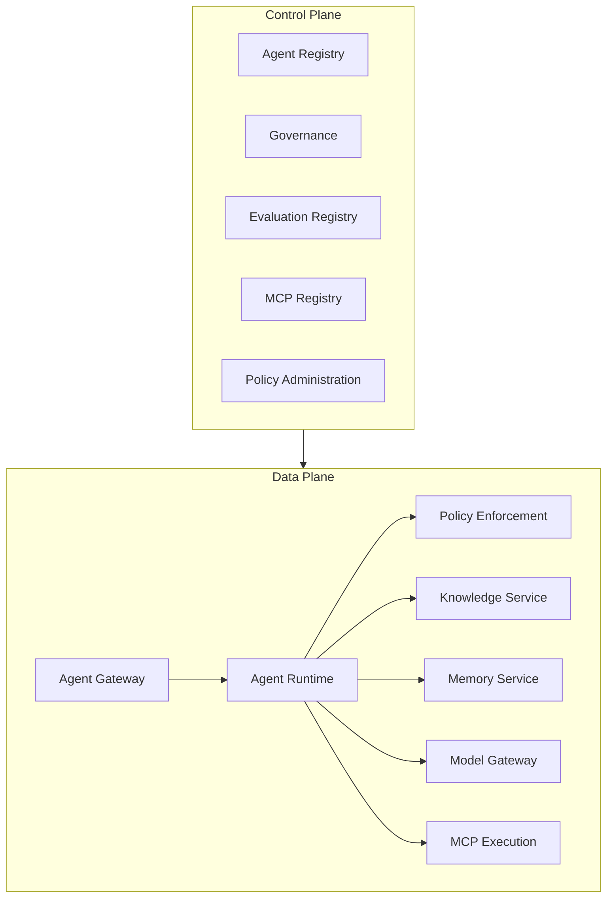

# Enterprise AI Platform

Esta documentação descreve uma arquitetura de referência e uma vertical slice para plataformas corporativas de IA.

## Objetivos

- desacoplar agentes dos provedores de modelos;
- governar agentes, ferramentas, conhecimento e memória antes da publicação;
- aplicar autorização e políticas em todas as fronteiras;
- operar com rastreabilidade, avaliação contínua e controle de custo;
- fornecer contratos versionados para APIs, eventos e ferramentas MCP.

## Arquitetura resumida

## Comece por aqui

1. [Control plane e data plane](architecture/control-plane-data-plane.md)
2. [Requisitos não funcionais](architecture/non-functional-requirements.md)
3. [Contratos HTTP](contracts/openapi.yaml)
4. [Contratos de eventos](contracts/async-api.yaml)
5. [AI Risk Framework](governance/ai-risk-framework.md)
6. [Vertical slice](https://github.com/leandrosflora/enterprise-ai-platform-demo-arch/tree/main/samples/vertical-slice)
