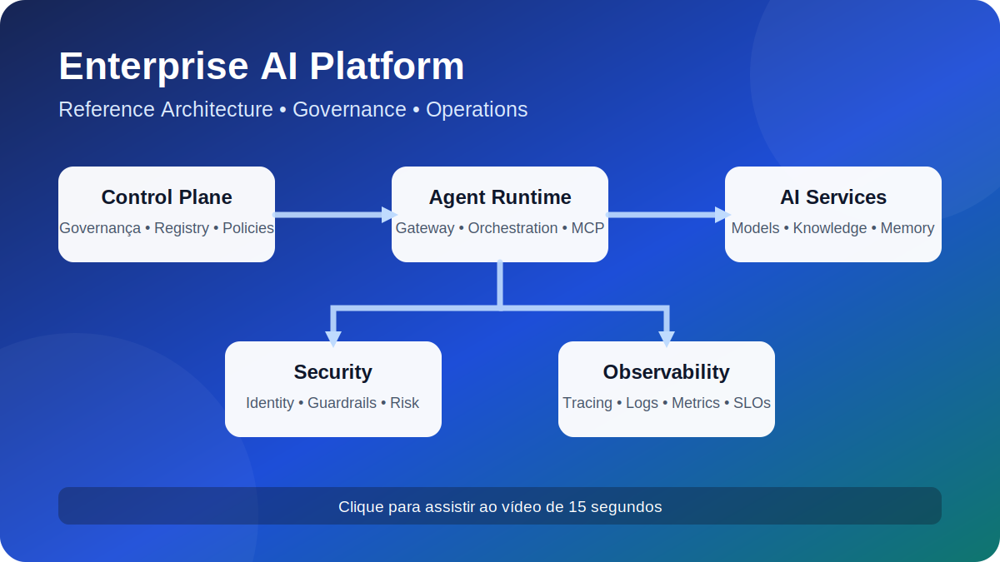
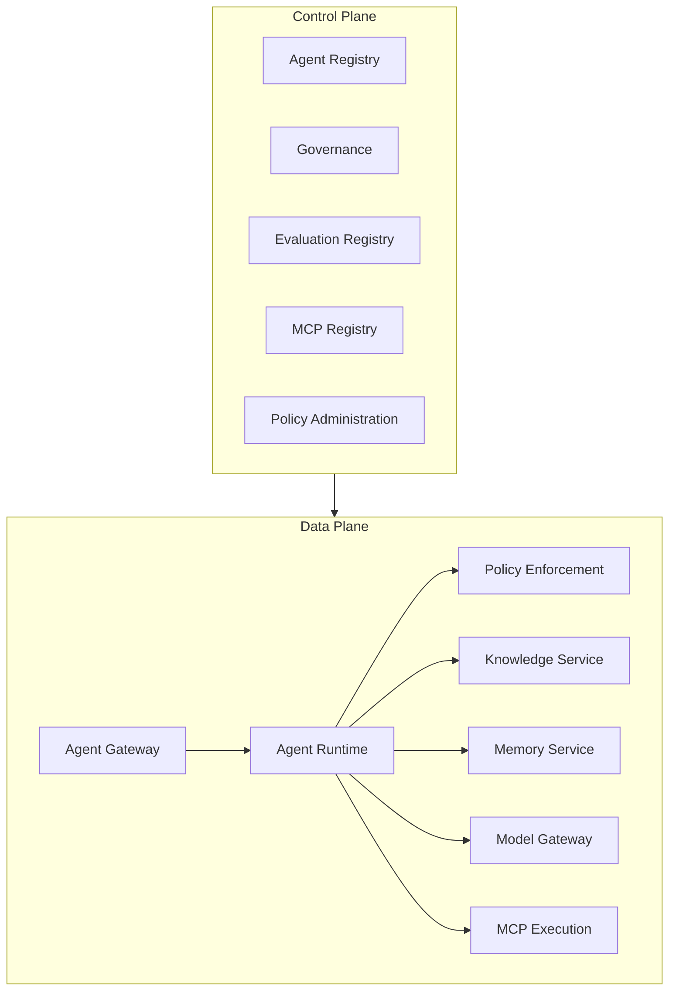

# Enterprise AI Platform Reference Book

> Arquitetura, tracing, logs, métricas e reference book em uma visão rápida. Clique na imagem para assistir ao vídeo de 15 segundos.

Este site apresenta um **book de referência para orientar o desenho, a governança, a implementação e a operação de plataformas corporativas de IA**.

Ele combina narrativa editorial, modelos arquiteturais, contratos, policies, checklists e uma pequena amostra técnica usada apenas para validar parte dos artefatos documentados.

> Este projeto não entrega uma plataforma pronta nem prescreve uma implementação tecnológica única. Os componentes e serviços representam capacidades lógicas que devem ser adaptadas ao contexto de cada organização.

## Comece pelo seu objetivo

-   :material-briefcase-outline: **Visão executiva**

    ---

    Entenda por que a plataforma é necessária e conecte estratégia, outcomes, capacidades e investimento.

    [Começar pelos outcomes](book/02-business-outcomes.md)

-   :material-sitemap-outline: **Arquitetura**

    ---

    Explore capability map, control plane, data plane, serviços, contratos e decisões.

    [Abrir o capability map](book/02-capability-map.md)

-   :material-account-group-outline: **Operating model**

    ---

    Defina papéis, RACI, fóruns, golden path e rotas proporcionais ao risco.

    [Ler o operating model](book/03-operating-model.md)

-   :material-source-branch: **Delivery e lifecycle**

    ---

    Estruture gates, evidências, avaliação, publicação, operação e retirada de agentes e ativos de IA.

    [Abrir o lifecycle de ativos](governance/model-lifecycle.md)

-   :material-shield-check-outline: **Segurança e governança**

    ---

    Aplique controles rastreáveis, autorização, threat modeling, segurança de RAG, memória, LGPD e AI Risk Framework.

    [Abrir o crosswalk de compliance](governance/compliance-crosswalk.md)

-   :material-flask-outline: **Estudo de caso**

    ---

    Acompanhe um agente documental com RAG do problem statement ao checklist de produção.

    [Abrir o estudo de caso](book/05-case-study-document-agent.md)

## Livro

1. [Por que uma AI Platform?](book/01-why-ai-platform.md)
2. [Business Outcomes](book/02-business-outcomes.md)
3. [Capability Map](book/02-capability-map.md)
4. [Operating Model](book/03-operating-model.md)
5. [Ciclo de vida de agentes](book/04-agent-lifecycle.md)
6. [Estudo de caso: agente documental com RAG](book/05-case-study-document-agent.md)
7. [Decision Guides](book/06-decision-guides.md)
8. [Modelo de maturidade e roadmap](book/07-adoption-roadmap.md)
9. [Checklists de produção](book/08-production-checklists.md)
10. [Glossário](book/glossary.md)

## Arquitetura resumida

A decomposição acima é lógica. Ela não determina quantidade de serviços, tecnologia, produto ou topologia de implantação.

## Referências canônicas

| Assunto | Fonte |
|---|---|
| Decisões arquiteturais | [Catálogo de ADRs](adrs/index.md) |
| APIs HTTP | [OpenAPI](contracts/openapi.yaml) |
| Eventos | [AsyncAPI](contracts/async-api.yaml) |
| Governança e compliance | [Crosswalk](governance/compliance-crosswalk.md) |
| Lifecycle de ativos de IA | [Data, Model, Prompt and Knowledge Lifecycle](governance/model-lifecycle.md) |
| Segurança de RAG e memória | [Padrão](security/rag-memory-security.md) |
| Risco | [AI Risk Framework](governance/ai-risk-framework.md) |
| SLOs | [Requisitos não funcionais](architecture/non-functional-requirements.md) |
| Deployment de referência | [C4 Deployment](architecture/diagrams/c4-deployment.puml) |
| Amostra de validação | [Vertical slice](https://github.com/leandrosflora/enterprise-ai-platform-demo-arch/tree/main/samples/vertical-slice) |

## PDF

O workflow **Book** gera um manuscrito Markdown consolidado, um PDF e previews renderizados. Os arquivos ficam disponíveis como artifact do GitHub Actions a cada execução do workflow.
