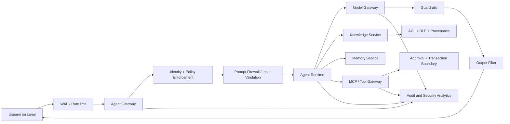

# AI Security Architecture

## Objet

Putting defence in depth on all fronts of the platform: identity, entry, context, model, tools, memory, exit and auditory.

## Reference window

## Controls by slut

| Camada | Minimum controls |
|---|---|
| Edge | WAF, rate limit, bot protection, quotas and anti-abus protection |
| Identidade | OIDC, MFA, workload identity, short and less preferred tokens |
| Authorisation | RBAC/ABAC, PDP/PEP, deny by default e policy versionada |
| Entrada | validation, limits, detection of prompt injection and data classification |
| RAG | approuvé sources, quarentene, provenance, ACL by chunk and DLP |
| Model | central gateway, model allowlist, limited parsel and guardrails |
| Ferramentas | schemas, allowlist, idempotence, timeout and human adoption |
| Memory | finality, consent, isolation by sujee, TTL and excluding |
| Sahara | 'Causeness, redaction, content safety, schema validation and references' |
| Auditoria | ID, identity, policy version, model, prompt and decision |

## Zero trust for IA

No component is implicitly based on the data collected or recovered. Each call must authenticate identity, authorise the action, validate the payload and register the decision.

Principles:

- verificar explicitamente cada acesso;
- obtaining copyright of documents, prompts and tools;
- limit blast radius by tenant, agent, model and tool;
- use temporary credentials;
- Keep sensitive data out of logs and trace.

## Critical borders

### RAG

Documents pass by malware scan, classification, DLP, origin validation and quarantine before indexing. The authorisation filter must occur in the consultation and again before the prompt assembly.

### Tool use

All tools can be contractual, esthetic, risk, ownership and policy. Operation with the same effect colateral uses key idempotency, transaction boundary and explicit confirmation.

### Provider externo

Model Gateway prevents direct access to the driver, applies residability and retention policy, removes prohibited data, checks approved models and accounts for consumption.

## Segredos e chaves

- storing in secret manager or KMS;
- shall never include in prompt, memory or repository;
- rotacionar automaticamente;
- separate keys by environment and finality;
- block out of secret registers by DLP.

## Incident response

Minimum events:

- prompt injection tentative;
- exfiltration or cross-tenant access;
- tool call negated or anomal;
- abrupt increase in cost or tokens;
- change of model or policy without approval;
- a sensitive content in the exit;
- poisoning detected in knowledge or memory.

The answer must allow for credible review, deactivate agent, block model or tool, remove index, preserve evidence and execute rollback.
