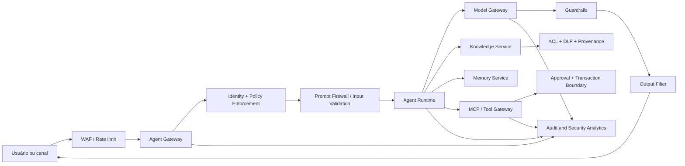

# AI Security Architecture

## Objective

Apply defense in depth at all platform boundaries: identity, entry, context, model, tools, memory, output and audit.

## Reference architecture

## Layer controls

| Camada | Minimum controls |
|---|---|
| Edge | WAF, rate limit, bot protection, quotas and abuse protection |
| Identity | ICDC, MFA, workload identity, short tokens and less privilege |
| Authorization | RBAC/ABAC, PDP/PEP, deny by default and policy versionada |
| Entry | validation, limits, prompt injection detection and data classification |
| RAG | approved sources, quarantine, provena, ACL by chunk and DLP |
| Model | central gateway, model allowlist, limited parameters and guardrails |
| Tools | schemas, allowlist, inadequacy, timeout and human approval |
| Memory | purpose, consent, subject isolation, TTL and exclusion |
| Departure | groundedness, redaction, content safety, schema validation and citations |
| Audit | correlation ID, identity, policy version, model, prompt and decision |

## Zero trust for AI

No component trusts implicitly on the content generated or retrieved. Each call must authenticate the identity, authorise the action, validate payload and register the decision.

Principles:

- explicitly verify each access;
- to take on the commitment of documents, prompts and tools;
- limiting blast radius by tenant, agent, model and tool;
- use temporary credentials;
- keep sensitive data out of logs and traces.

## Critical borders

### RAG

Documents undergo malware scan, classification, DLP, origin validation and quarantine before indexing. The authorization filter should occur at consultation and again before assembling the prompt.

### Tool use

Each tool has a contract, scope, risk, owner and policy.Side effect operations use idempotency key, transaction boundary and explicit confirmation.

### Provider externo

Model Gateway prevents direct access to the provider, applies residence and retention policies, removes prohibited data, controls approved models and registers metadata of consumption.

## Secrets and keys

- armazenar em secret manager ou KMS;
- never include in prompt, memory or repository;
- rotacionar automaticamente;
- separate keys by environment and purpose;
- block output of secrecy patterns by DLP.

## Incident response

Minimum events:

- attempt to inject;
- exfiltration or cross-tenant access;
- tool call denied or anomalous;
- abrupt increase in cost or tokens;
- change of model or policy without approval;
- sensitive content in output;
- poisoning detected in knowledge or memory.

The response should allow for the revocation of credentials, disabling agents, blocking model or tools, removing index, preserving evidence and performing rollback.
