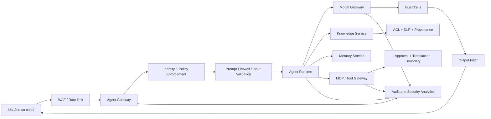

# AI Security Architecture

## Objective

Apply in-depth defense across all platform boundaries: identity, input, context, model, tools, memory, output and audit.

## Reference architecture

## Layered controls

| Layer | Minimum controls |
|---|---|
| Edge | WAF, rate limit, bot protection, quotas and protection against abuse |
| Identidade | OIDC, MFA, workload identity, short tokens and minor privilege |
| Authorization | RBAC/ABAC, PDP/PEP, deny by default and policy versioned |
| Entrada | the validation, limits, detection of prompt injection and data classification; |
| RAG | The Commission shall adopt delegated acts in accordance with Article 21 of Regulation (EU) No 1308/2013. |
| Model | Central gateway, model allowlist, restricted parameters and guardrails |
| Ferramentas | Schemes, allowlist, idempotence, timeout and human approval |
| The memory | purpose, consent, isolation by subject, TTL and exclusion |
| Exit | The Commission shall adopt delegated acts in accordance with Article 21 of Regulation (EU) No 182/2011 and in accordance with Article 21 thereof. |
| Auditoria | correlation ID, identity, policy version, model, prompt and decision |

## Zero trust for AI

Each call must authenticate the identity, authorize the action, validate the payload, and record the decision.

The following principles:

- verificar explicitamente cada acesso;
- to commit to documents, prompts and tools;
- limiting the blast radii per tenant, agent, model and tool;
- use temporary credentials;
- Keep sensitive data out of logs and traces.

## Critical boundaries

### RAG

Documents undergo malware scan, classification, DLP, origin validation and quarantine before indexing.

### Tool use

Each tool has a contract, scope, risk, owner and policy, and collateral transactions use idempotency key, transaction boundary, and explicit confirmation.

### Provider externo

The Model Gateway prevents direct access to the provider, implements a residence and retention policy, removes prohibited data, controls approved models and records consumption metadata.

## Secrets and keys

- store in secret manager or KMS;
- Never include in prompt, memory or repository;
- rotacionar automaticamente;
- separating keys by environment and purpose;
- block the output of secret patterns by DLP.

## Incident response

Minimum events:

- the attempt of prompt injection;
- Exfiltration or cross-tenant access;
- tool call denied or abnormal;
- a sharp increase in cost or tokens;
- change of model or policy without approval;
- sensitive output content;
- Poisoning detected in knowledge or memory.

The response shall allow credentials to be revoked, agent disabled, model or tool blocked, index removed, evidence preserved and rollback performed.
