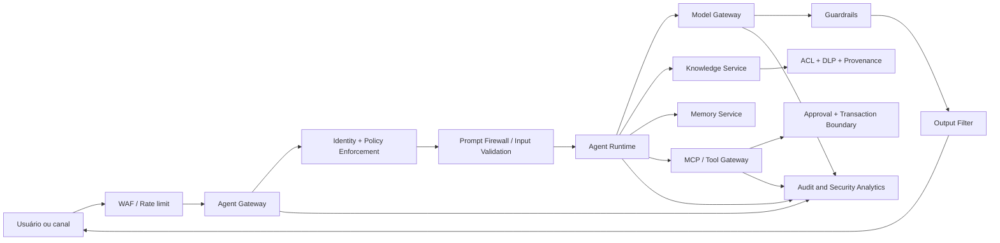

# AI Security Architecture

## Objetivo

Aplicar defesa em profundidade em todas as fronteiras da plataforma: identidade, entrada, contexto, modelo, ferramentas, memória, saída e auditoria.

## Arquitetura de referência

## Controles por camada

| Camada | Controles mínimos |
|---|---|
| Edge | WAF, rate limit, bot protection, quotas e proteção contra abuso |
| Identidade | OIDC, MFA, workload identity, tokens curtos e menor privilégio |
| Autorização | RBAC/ABAC, PDP/PEP, deny by default e policy versionada |
| Entrada | validação, limites, detecção de prompt injection e classificação de dados |
| RAG | fontes aprovadas, quarentena, proveniência, ACL por chunk e DLP |
| Modelo | gateway central, allowlist de modelos, parâmetros limitados e guardrails |
| Ferramentas | schemas, allowlist, idempotência, timeout e aprovação humana |
| Memória | finalidade, consentimento, isolamento por sujeito, TTL e exclusão |
| Saída | groundedness, redaction, content safety, schema validation e citações |
| Auditoria | correlation ID, identidade, versão de política, modelo, prompt e decisão |

## Zero trust para IA

Nenhum componente confia implicitamente em conteúdo gerado ou recuperado. Cada chamada deve autenticar a identidade, autorizar a ação, validar o payload e registrar a decisão.

Princípios:

- verificar explicitamente cada acesso;
- assumir comprometimento de documentos, prompts e ferramentas;
- limitar blast radius por tenant, agente, modelo e ferramenta;
- usar credenciais temporárias;
- manter dados sensíveis fora de logs e traces.

## Fronteiras críticas

### RAG

Documentos passam por malware scan, classificação, DLP, validação de origem e quarentena antes da indexação. O filtro de autorização deve ocorrer na consulta e novamente antes da montagem do prompt.

### Tool use

Toda ferramenta possui contrato, escopo, risco, owner e política. Operações com efeito colateral usam idempotency key, transaction boundary e confirmação explícita.

### Provider externo

O Model Gateway impede acesso direto ao provedor, aplica política de residência e retenção, remove dados proibidos, controla modelos aprovados e registra metadados de consumo.

## Segredos e chaves

- armazenar em secret manager ou KMS;
- nunca incluir em prompt, memória ou repositório;
- rotacionar automaticamente;
- separar chaves por ambiente e finalidade;
- bloquear saída de padrões de segredo por DLP.

## Incident response

Eventos mínimos:

- tentativa de prompt injection;
- exfiltração ou acesso cross-tenant;
- tool call negada ou anômala;
- aumento abrupto de custo ou tokens;
- mudança de modelo ou política sem aprovação;
- conteúdo sensível em saída;
- poisoning detectado em conhecimento ou memória.

A resposta deve permitir revogar credenciais, desabilitar agente, bloquear modelo ou ferramenta, retirar índice, preservar evidências e executar rollback.
